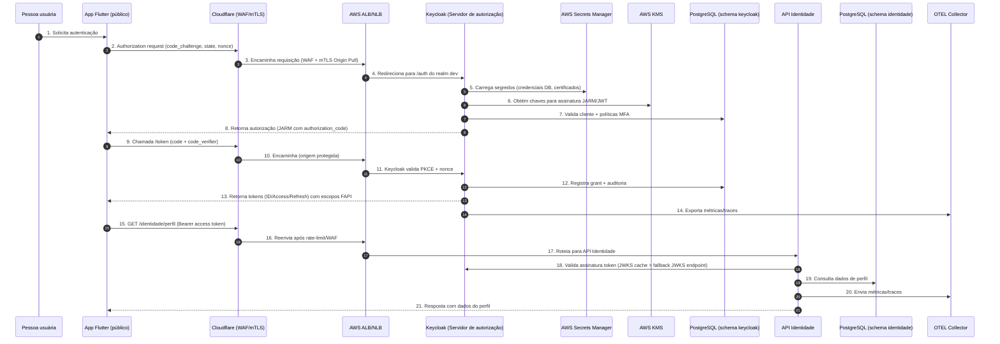
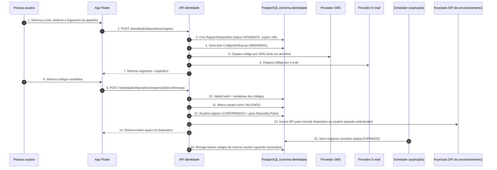
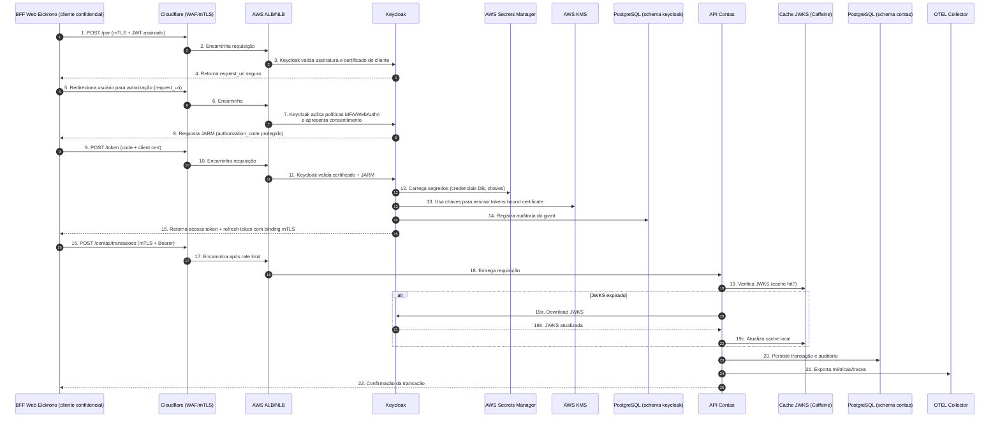
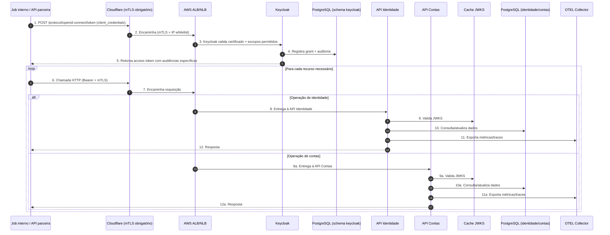
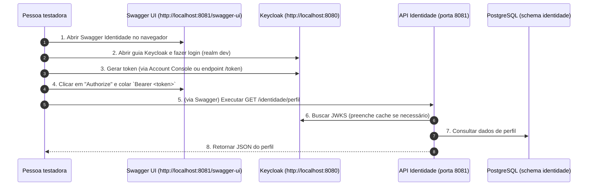
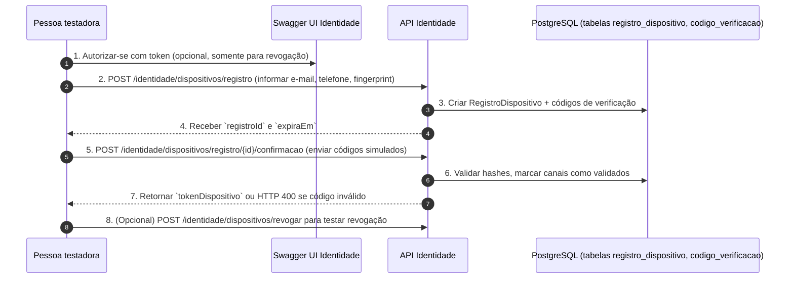
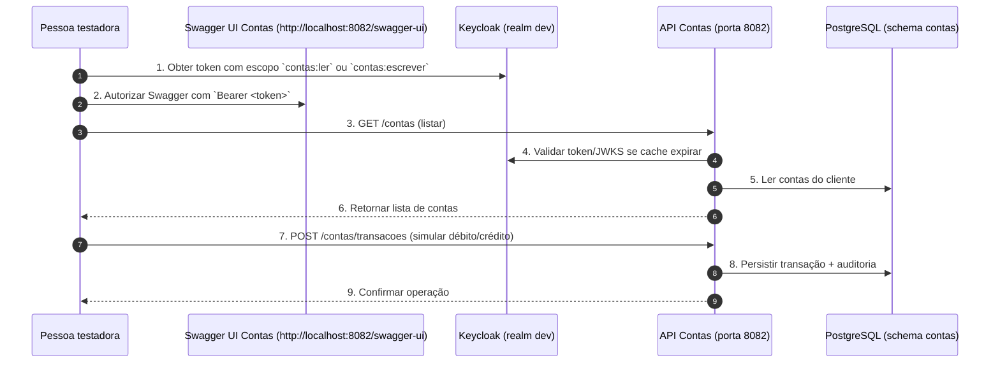

# Diagramas de sequência por caso de uso

Este documento apresenta dois conjuntos de diagramas:

- **Versão completa (produção)** — fluxos com todos os componentes de segurança, observabilidade e integrações que operam no ambiente oficial.
- **Versão simplificada (dev / Swagger)** — o mínimo necessário para reproduzir e testar os serviços localmente via Swagger UI, com foco em equipes de QA ou desenvolvimento.

Todos os diagramas usam sintaxe Mermaid.

---

## Versão completa (produção)

Os fluxos abaixo representam o comportamento end-to-end considerado para produção. Use-os como referência arquitetural.

---

## Caso 1 – Login inicial do app móvel (Authorization Code + PKCE)

**Resumo:** o aplicativo inicia o fluxo PKCE, Keycloak autentica a pessoa usuária e devolve tokens. O app consome a API de Identidade usando o access token, que é validado pelos JWKS do Keycloak. Secrets Manager e KMS sustentam credenciais e chaves, enquanto OTEL registra observabilidade. Esse caso cobre o “primeiro acesso” típico.

---

## Caso 2 – Registro e confirmação de dispositivo móvel

**Resumo:** este fluxo prepara o dispositivo móvel para operações sensíveis. A API cria registros pendentes, envia códigos por SMS/E-mail e somente após a confirmação dupla libera um `DispositivoToken`. O scheduler remove registros não confirmados. Em ambientes autenticados, o SPI do Keycloak sincroniza o dispositivo no realm.

---

## Caso 3 – Transação financeira via BFF web (cliente confidencial com mTLS, PAR/JAR/JARM)

**Resumo:** o BFF, como cliente confidencial, utiliza PAR/JAR/JARM com mTLS. Os tokens emitidos por Keycloak são vinculados ao certificado, garantindo proteção ao serem enviados para a API de Contas. O fluxo finaliza com operação persistida no banco e métricas exportadas.

---

## Caso 4 – Integração interna/batch utilizando client credentials

**Resumo:** jobs internos ou integrações parceiras autenticam-se com `client_credentials` e certificado mTLS. Dependendo do endpoint, a requisição alcança a API de Identidade ou de Contas, ambas validando o token via JWKS e registrando observabilidade. O ciclo se repete para cada recurso processado.

---

### Como usar estes diagramas

- Utilize ferramentas com suporte a Mermaid (GitHub, VS Code, Mermaid Live Editor) para visualizar os fluxos em formato gráfico.
- Os números de cada etapa facilitam o cruzamento com logs, traces OTEL e auditorias em banco.
- Para novos casos de uso, replique a estrutura: identifique atores, serviços, configurações sensíveis (segredos, certificados) e descreva o encadeamento ponta a ponta.

---

## Versão simplificada (dev / Swagger)

Os diagramas seguintes assumem o ambiente local (`docker compose` em `infraestrutura/dev`) com Swagger habilitado e sem mTLS. Servem como mapa rápido para testar manualmente chamadas REST usando tokens emitidos pelo Keycloak local.

### Caso A – Gerar token e consultar perfil no Swagger

**Uso prático:** valida os escopos `identidade:ler` e o acesso básico com bearer token. Se a resposta for 401, confirme o passo 4.

### Caso B – Testar fluxo de registro de dispositivo via Swagger

**Uso prático:** permite testar manualmente os cenários felizes, erros de código incorreto e revogação, sem depender de provedores SMS/e-mail.

### Caso C – Simular transferência via API de Contas no Swagger

**Uso prático:** cobre leitura e escrita na API de Contas. Para validar erros, altere o token (escopo insuficiente) ou campos obrigatórios.

---

### Dicas para os testes via Swagger

- Mantenha Keycloak e as APIs rodando (`docker compose up -d`) antes de abrir o Swagger.
- Atualize os tokens periodicamente; em dev, os default expiram em minutos.
- Use os comandos de rebuild descritos em `guia-debug-eclipse.md` se alterar código antes de testar novamente.
