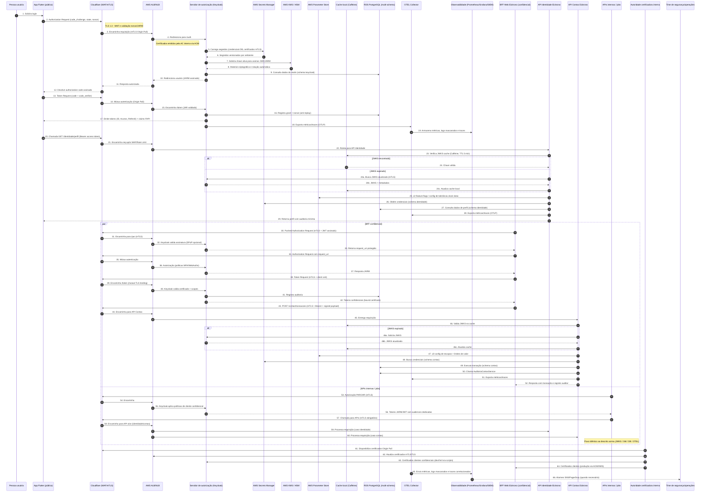

# Diagrama de sequência – Plataforma Eickrono Autenticação

Abaixo está o fluxo completo que cobre desde o login via Authorization Code + PKCE até as chamadas das APIs protegidas (identidade e contas), incluindo os bastidores de segurança, armazenamento de segredos, auditoria e observabilidade. O diagrama utiliza sintaxe Mermaid para facilitar a visualização em ferramentas compatíveis.

## Notas de leitura

- **Multiplicidade de clientes**: o mesmo fluxo se aplica ao aplicativo Flutter (PKCE), ao BFF web e às APIs internas, variando apenas a forma de autenticação (público vs. confidencial com mTLS). 
- **Cache JWKS local**: ambas as APIs utilizam Caffeine com TTL de 5 minutos e tamanho máximo de 1000 entradas para evitar chamadas repetidas ao Keycloak. 
- **Auditoria**: a API de Contas invoca `AuditoriaContasService` para registrar acessos e eventos no esquema `contas`, garantindo rastreabilidade. 
- **Segurança de segredos**: Secrets Manager armazena credenciais e certificados, enquanto o KMS/HSM fornece criptografia e assinatura das chaves JWK, com rotação automática. 
- **Observabilidade integrada**: cada serviço exporta métricas e traces via OTLP para o coletor OTEL, que os encaminha para Prometheus, Grafana, CloudWatch Logs e o SIEM corporativo. 
- **Compatibilidade FAPI**: Keycloak opera com PAR, JAR, JARM, mTLS, MFA/WebAuthn e tolerância mínima de clock skew (1 min) auditada pelas APIs.
