# Guia de Fluxos de Login e Autenticacao do App Movel

Este guia consolida, no nivel mais detalhado possivel, como os fluxos de
login, autenticacao, sessao social, registro de dispositivo, vinculacao
social, cadastro, foto de perfil e recuperacao de senha funcionam hoje no
ecossistema Eickrono para o app movel.

Se houver conflito entre este guia e documentos macro de arquitetura, deve-se
assumir que este guia prevalece para:

- leitura do runtime efetivo do app;
- revisao dos fluxos reais publicados;
- analise de erros reais em `dev`, `hml` e `prod`;
- fechamento das proximas correcoes funcionais e tecnicas do login.

Este guia foi reorganizado em duas partes principais:

- especificacao funcional detalhada;
- especificacao tecnica detalhada.

Os fluxogramas foram preservados e ficaram concentrados na parte tecnica.

Regra de leitura deste documento:

- secoes `2` e `3` descrevem apenas:
  - fato observado no runtime atual;
  - divergencia confirmada no runtime atual;
  - ou decisao adotada explicitamente marcada como `decisao`;
- secao `4` contem diretrizes de consolidacao, decisoes adotadas e criterios de manutencao;
- secao `5` contem contratos consolidados;
- secao `6` descreve o uso recomendado do guia.

Ou seja: este guia nao deve misturar fato e opiniao sem rotulo explicito.

## 1. Escopo e fontes observadas

Este guia foi consolidado a partir do codigo atualmente em uso em:

- `eickrono-identidade-servidor`
- `eickrono-autenticacao-servidor`
- `eickrono-thimisu/eickrono-thimisu-app`
- `eickrono-autenticacao-cliente`

Fontes principais observadas:

- `eickrono-identidade-servidor/src/main/java/com/eickrono/api/identidade/apresentacao/api/FluxoPublicoController.java`
- `eickrono-identidade-servidor/src/main/java/com/eickrono/api/identidade/apresentacao/api/RegistroDispositivoController.java`
- `eickrono-identidade-servidor/src/main/java/com/eickrono/api/identidade/aplicacao/servico/CadastroContaInternaServico.java`
- `eickrono-identidade-servidor/src/main/java/com/eickrono/api/identidade/aplicacao/servico/AutenticacaoSessaoInternaServico.java`
- `eickrono-identidade-servidor/src/main/java/com/eickrono/api/identidade/aplicacao/servico/LocalizadorPerfilSistemaProjetoPorEmailJdbc.java`
- `eickrono-thimisu/eickrono-thimisu-app/lib/funcionalidades/autenticacao/aplicacao/controlador_login.dart`
- `eickrono-thimisu/eickrono-thimisu-app/lib/funcionalidades/autenticacao/aplicacao/servico_avatar_social_cadastro.dart`
- `eickrono-thimisu/eickrono-thimisu-app/lib/nucleo/injecao/provedores_aplicativo.dart`
- `eickrono-autenticacao-servidor/modulos/modulo-eickrono-autenticacao/src/main/java/com/eickrono/api/identidade/apresentacao/api/FluxoPublicoController.java`
- `eickrono-autenticacao-servidor/modulos/modulo-eickrono-keycloak/src/main/java/com/eickrono/servidor/autorizacao/infraestrutura/versao/ProvedoresSociaisRuntimeLeitor.java`

Nota estrutural importante:

- este guia referencia tanto `eickrono-identidade-servidor` quanto caminhos
  atuais como `eickrono-autenticacao-servidor/modulos/modulo-eickrono-autenticacao`;
- essas referencias significam apenas **onde o codigo esta hoje** e quais
  partes do runtime ainda estao em migracao;
- isso nao significa aprovacao permanente de monorepo nem de “um modulo por
  dominio/produto” dentro de `eickrono-autenticacao-servidor`;
- o alvo aprovado continua sendo:
  - `eickrono-autenticacao-servidor` como projeto simples, central e
    reutilizavel;
  - `autenticacao` como borda publica final do app;
  - `identidade` apenas por backchannel interno quando ainda for necessaria;
  - `contas` fora do escopo arquitetural deste guia.

## 2. Especificacao funcional detalhada

### 2.1 Objetivo funcional do conjunto

O conjunto de login e autenticacao do app movel precisa resolver cinco
necessidades principais:

- permitir entrada por senha;
- permitir entrada por rede social;
- permitir retomada de cadastro ainda nao concluido;
- permitir vinculacao de uma rede social a uma conta ja existente;
- permitir concluir a sessao do app com `accessToken`, `refreshToken` e
  `X-Device-Token`.

### 2.2 Resultado funcional esperado pelo operador

Do ponto de vista do operador do app, o sistema precisa responder sempre uma
das situacoes abaixo:

- autenticou e pode entrar agora;
- autenticou centralmente, mas ainda falta completar o dispositivo;
- autenticou na rede social, mas ainda nao existe conta local do projeto;
- a conta existe, mas ainda nao esta liberada para uso;
- a conta existe, mas ainda falta retomar cadastro ou validacao;
- a credencial esta errada;
- a sessao central esta valida, mas falta contexto local para aquele projeto.

### 2.3 Atores funcionais

#### 2.3.1 Operador do app

O operador pode:

- criar cadastro;
- confirmar e-mail;
- confirmar telefone, quando aplicavel;
- entrar por senha;
- entrar por Apple, Google ou outro provedor social publicado;
- recuperar senha;
- escolher ou trocar foto de perfil;
- vincular rede social a uma conta ja existente.

#### 2.3.2 App movel

O app precisa:

- coletar credenciais e sinais do dispositivo;
- chamar a borda publica efetiva;
- interpretar erros publicos;
- decidir a UX de retomada, cadastro, vinculacao e liberacao;
- concluir a sessao do dispositivo.

#### 2.3.3 Servidor de identidade

Hoje a `identidade` ainda exerce duas funcoes publicas:

- borda publica efetiva de login, cadastro e recuperacao de senha do app;
- borda autenticada para fechamento de `registro/silencioso`,
  `registro/confirmacao`, vinculacao e sincronizacao social.

#### 2.3.4 Servidor de autenticacao e Keycloak

O conjunto `autenticacao + Keycloak` continua sendo o dono de:

- senha;
- refresh token;
- sessao central;
- token exchange social;
- brokers sociais;
- fila de pendencias de provisionamento do produto;
- visibilidade runtime dos provedores sociais.

No alvo estrutural aprovado, esse conjunto deve permanecer:

- central;
- generico para qualquer app/site/projeto cadastrado;
- sem modulo especifico por produto;
- e sem acoplamento interno com `contas`.

#### 2.3.5 Backend do produto

O backend do produto nao participa da autenticacao central em si. Ele entra
depois, quando ja existe ou precisa existir o perfil do sistema naquele
produto.

### 2.4 Conceitos funcionais centrais

#### 2.4.1 Conta central

Conta central e a conta do ecossistema, controlada por `autenticacao` e
Keycloak. Ela responde por senha, federacao social, sessao central e tokens
centrais.

#### 2.4.2 Perfil do sistema

Perfil do sistema e o contexto local daquele usuario dentro de um produto
especifico. Ele e o que determina se aquele app/projeto pode operar.

#### 2.4.3 Sessao central

Sessao central e o par `accessToken + refreshToken` emitido no fluxo central.
Ela nao substitui automaticamente o contexto local do projeto.

#### 2.4.4 Token de dispositivo

`X-Device-Token` e o token que completa a sessao do app para o contexto local.
Sem ele, pode existir autenticacao central, mas ainda nao sessao pronta para
uso pleno do projeto.

#### 2.4.5 Sessao social

Sessao social e o caso em que a autenticacao central nasceu de Apple, Google ou
outro provedor social, em vez de senha.

#### 2.4.6 Registro silencioso

`registro/silencioso` e o nome atual do endpoint que tenta **completar a
sessao local do dispositivo** depois que a autenticacao central ja aconteceu.

Funcionalmente, ele existe para fazer esta pergunta:

- "com esta sessao central ja autenticada, este dispositivo ja pode receber o
  `X-Device-Token` e entrar no contexto local deste projeto sem precisar de
  codigo, tela extra ou confirmacao manual?"

Na pratica, esse endpoint tenta:

- ler a sessao central que o app ja recebeu;
- resolver o `perfil do sistema` correspondente;
- verificar se esse perfil pode concluir sessao naquele projeto;
- emitir o `X-Device-Token` quando tudo estiver coerente.

Entao, o nome `silencioso` nao descreve a finalidade real do fluxo. Ele
descreve apenas o modo de execucao:

- sem etapa manual extra para o operador.

O que ele **realmente faz** e:

- completar a sessao local do dispositivo;
- amarrar a sessao central ao contexto do projeto;
- entregar o `X-Device-Token`.

Por isso, em termos de semantica, nomes mais descritivos seriam algo como:

- `completar-sessao-dispositivo-automaticamente`
- `concluir-sessao-local-automaticamente`
- `emitir-token-dispositivo-automaticamente`

Ou, se a equipe quiser nomes um pouco mais curtos sem perder a ideia
principal:

- `completar-sessao-dispositivo`
- `concluir-sessao-local`
- `emitir-token-dispositivo`

com a documentacao deixando explicito que se trata de fluxo automatico, sem
passo manual adicional.

O nome atual continua sendo historico do runtime. O significado funcional
correto, porem, e este:

- **fechamento automatico da sessao local do dispositivo a partir de uma
  sessao central ja autenticada**.

#### 2.4.7 Erro `social_sem_conta_local`

Esse erro significa:

- a autenticacao social deu certo;
- a sessao central existe;
- mas ainda nao existe perfil do sistema pronto para aquele projeto.

Ele nao significa:

- senha errada;
- falha na Apple;
- falha no Google;
- falha no broker social por si so.

### 2.5 Regras funcionais atuais

#### 2.5.1 Cadastro

O cadastro publico atual:

- cria conta pendente;
- persiste `CadastroConta`;
- envia confirmacao de e-mail;
- pode exigir telefone;
- depois tenta confirmar a `Pessoa` canonica;
- depois tenta provisionar o perfil do sistema.

Hoje a regra mais nova do ecossistema ja admite:

- nao bloquear o login central apenas porque o produto ainda nao terminou seu
  provisionamento.

#### 2.5.2 Login por senha

O login por senha no runtime atual do app:

- autentica no conjunto central;
- valida atestacao e sinais locais;
- busca contexto do perfil do sistema;
- so conclui sessao se a combinacao central + contexto local estiver coerente.

#### 2.5.3 Login social

O login social no runtime atual do app:

- primeiro cria a sessao central;
- depois tenta obter o `X-Device-Token`;
- se nao houver conta local pronta, devolve contexto de retomada ou vinculacao.

#### 2.5.4 Recuperacao de senha

A recuperacao de senha:

- redefine senha central;
- nao conclui onboarding local por si so;
- nao libera sozinha o perfil do sistema;
- nao fecha sozinha pendencia de produto.

#### 2.5.5 Foto de perfil e redes sociais

Na tela de foto de perfil, autenticar numa rede social nao significa concluir
cadastro. Significa:

- tentar reaproveitar a sessao social;
- descobrir se aquela rede ja casa com uma conta local existente;
- ou reaproveitar os dados sociais para prefill (preenchimento inicial) de cadastro e avatar.

Essa regra vale tanto para:

- cadastro iniciado diretamente pelo formulario;
- cadastro iniciado a partir de uma autenticacao social anterior.

O comportamento funcional esperado da tela e o mesmo nos dois casos. O que
muda e apenas o estado inicial da tela:

- se o cadastro veio de uma autenticacao social anterior, a foto de perfil pode
  chegar prefillada (preenchida inicialmente) e uma rede social pode ja aparecer agregada ao contexto;
- se o cadastro foi iniciado diretamente pelo formulario, a tela comeca com o
  avatar padrao e sem rede social agregada.

#### 2.5.6 Cadastro em andamento com multiplas redes sociais

Quando o operador ja esta dentro de um cadastro em andamento, autenticar
`Apple`, `Google` ou outras redes sociais publicadas nao deve significar
"abrir um novo cadastro".

Nessa tela, a regra funcional correta e:

- a rede autenticada deve ser agregada ao cadastro em memoria;
- as redes ja autenticadas nao devem ser perdidas;
- a origem atualmente selecionada para o avatar pode mudar;
- a foto do dispositivo deve permanecer em cache local, se ja tiver sido
  escolhida;
- a pergunta de "abrir cadastro novo" nao faz sentido nesse contexto e nao
  deveria aparecer.

Portanto, dentro de um cadastro em andamento, a autenticacao social precisa ser
lida como:

- "adicionar mais uma rede a este cadastro";

e nao como:

- "decidir se quero iniciar outro cadastro".

#### 2.5.7 Lista de contas recentes na tela de login

Na tela de login, o app pode apresentar uma lista de contas locais recentes do
dispositivo.

Essa lista existe para dois objetivos:

- facilitar a retomada de uma conta ja usada naquele dispositivo;
- permitir selecao rapida de uma conta sem manter um bloco fixo ocupando a tela
  principal de login.

A regra funcional da lista e esta:

- a tela principal de login nao deve ficar permanentemente ocupada por essa
  lista;
- a lista deve aparecer quando o operador tocar no campo de e-mail/usuario,
  desde que ja exista pelo menos uma conta elegivel persistida localmente
  naquele dispositivo;
- se o operador tocar fora da lista sem escolher uma conta, a lista deve ser
  fechada;
- se o operador escolher uma conta da lista, o campo de login deve ser
  preenchido automaticamente com o identificador adequado daquela conta;
- o operador continua livre para ignorar a lista e digitar manualmente um
  terceiro usuario ou qualquer outro identificador.

Importante:

- contexto social pendente nao deve abrir nem se misturar com essa lista;
- se existir uma decisao de UX ligada a autenticacao social pendente, ela deve
  aparecer em componente proprio, separado da lista de contas recentes.

Cada item da lista deve exibir:

- a imagem de perfil da conta, quando existir;
- ou um avatar simples com as iniciais da conta, quando nao existir imagem de
  perfil vinculada;
- o usuario visivel sempre, como linha principal;
- o e-mail mascarado da conta, como linha secundaria e visualmente menor;
- a acao de remover aquela conta do dispositivo.

A mascara do identificador visivel da lista deve seguir esta regra:

- o usuario nunca deve ser mascarado;
- o e-mail aparece apenas na segunda linha, de forma mascarada;
- o e-mail deve preservar legibilidade minima sem expor o valor completo.

Regra funcional do e-mail mascarado:

- na parte local do e-mail:
  - 1 caractere -> `*`
  - 2 caracteres -> primeira letra + `*`
  - 3 ou mais -> primeira letra + `***` + ultima letra
- no dominio antes do primeiro ponto:
  - aplicar a mesma regra acima
- no sufixo:
  - preservar, por exemplo `.com`, `.com.br`, `.org`

Exemplos:

- `pedrosotc@gmail.com` -> `p***c@g***l.com`
- `ab@xy.com` -> `a*@x*.com`
- `a@b.com` -> `*@*.com`

Quando uma conta deve aparecer nessa lista:

- quando ja existir uma conta do app efetivamente persistida localmente naquele
  dispositivo, depois de uma autenticacao realmente concluida para uso do app;
- isso inclui contas que ja tenham sido aceitas para uso no app e tenham sido
  gravadas localmente como conta conhecida do dispositivo;
- isso pode incluir conta em `PENDENTE_LIBERACAO_PRODUTO`, desde que ela ja
  tenha sido tratada como conta valida para entrada no app e persistida como
  tal no catalogo local.

Quando uma conta nao deve aparecer:

- se ela nunca foi persistida localmente;
- se a autenticacao social serviu apenas para abrir cadastro, agregar rede
  social, escolher foto de perfil ou preencher dados em memoria;
- se o cadastro ainda nao foi concluido;
- se foi removida explicitamente da lista pelo operador;
- se o catalogo local ainda estiver vazio.

Regra funcional de remocao de conta da lista:

- tocar na acao de remover nao deve apagar imediatamente a conta;
- o app deve abrir uma mensagem explicita informando que, se o operador
  confirmar, aquela conta sera removida daquele dispositivo junto com os dados
  locais ainda nao sincronizados com o servidor;
- se o operador cancelar, nada deve acontecer;
- se o operador confirmar, o app deve exigir autenticacao por login e senha
  antes de remover o cache local e o banco local daquela conta no dispositivo;
- se a reautenticacao falhar ou for abandonada, a conta nao deve ser apagada.

#### 2.5.8 Decisao funcional: avatar padrao reagindo ao nome em tempo real

Como comportamento funcional adotado, o avatar padrao da tela de cadastro
deixa de ser apenas um icone estatico e passa a reagir ao campo de nome em
tempo real.

A regra funcional adotada e esta:

- enquanto o operador ainda nao escolheu foto do dispositivo nem foto social, o
  topo da tela mostra um avatar dinamico derivado do nome digitado;
- se nenhum nome relevante foi informado ainda, o topo continua com o icone
  generico atual;
- assim que o nome ganhar conteudo suficiente, o icone generico pode ser
  substituido por um monograma de iniciais;
- se o operador selecionar uma foto do dispositivo ou uma foto social, essa
  foto passa a ter prioridade visual sobre o monograma;
- se a foto selecionada for removida e nao houver outra origem visual ativa, a
  tela volta a mostrar o monograma derivado do nome, se houver nome;
- se nao houver nome e nem foto, a tela volta ao icone generico.

Esse comportamento vale tanto para:

- cadastro iniciado diretamente pelo formulario;
- cadastro iniciado a partir de uma rede social autenticada.

Nos dois casos, a regra e a mesma. O que muda e apenas o estado inicial:

- no cadastro vindo de rede social, pode ja existir uma foto real prevalecendo
  sobre o monograma;
- no cadastro direto, a tela tende a começar no icone generico e depois migrar
  para iniciais conforme o nome for digitado.

#### 2.5.9 Decisao funcional: regra para calcular as iniciais

Para evitar ambiguidade, a regra funcional adotada pode ser descrita assim:

- remover espacos repetidos nas extremidades e no meio;
- resolver primeiro o idioma ativo da interface;
- carregar a lista de conectivos ignorados daquele idioma;
- desconsiderar conectivos apenas quando eles estiverem na lista do idioma
  atual;
- considerar apenas palavras significativas do nome;
- se nao restar nenhuma palavra significativa, manter o icone generico;
- se restar uma palavra significativa:
  - usar ate as duas primeiras letras dessa palavra;
- se restarem duas palavras significativas:
  - usar a primeira letra da primeira e a primeira letra da segunda;
- se restarem tres ou mais palavras significativas:
  - usar a primeira letra das tres primeiras palavras significativas.

Regra importante:

- a exclusao de conectivos nao deve ficar hardcoded apenas para portugues;
- ela deve ser tratada como dado dependente de idioma;
- cada idioma publicado no app deve declarar explicitamente:
  - quais tokens devem ser ignorados;
  - ou que nao existe exclusao para aquele idioma.

Isso significa:

- para portugues, a lista inicial pode conter `da`, `de`, `do`, `das`, `dos`
  e `e`;
- para outros idiomas, a lista deve ser definida caso a caso;
- para idiomas em que essa regra nao faca sentido, a lista deve ser vazia;
- lista vazia e um caso valido e esperado, nao erro.

Exemplos funcionais:

- locale `pt`:
  - `Thiago` -> `TH`
  - `Thiago Christian` -> `TC`
  - `Thiago Christian Pedroso` -> `TCP`
  - `Maria da Silva` -> `MS`
  - `Ana de Souza Lima` -> `ASL`
- locale com lista vazia de conectivos ignorados:
  - `Thiago Christian Pedroso` -> `TCP`
  - `Maria da Silva` -> o resultado deve seguir a tokenizacao integral daquele
    idioma, sem excluir palavras automaticamente

### 2.6 Cenarios funcionais possiveis

#### 2.6.1 Cenarios de cadastro

1. cadastro novo com e-mail e telefone obrigatorio;
2. cadastro novo com e-mail e sem telefone obrigatorio;
3. cadastro confirmado com produto respondendo normalmente;
4. cadastro confirmado com produto temporariamente indisponivel;
5. cadastro confirmado com conta central pronta, mas perfil do sistema ainda
   pendente;
6. retomada de cadastro ainda nao finalizado.

#### 2.6.2 Cenarios de login por senha

1. login valido com perfil do sistema liberado;
2. login valido com conta ainda nao liberada;
3. login com senha invalida;
4. login com conta desabilitada;
5. login com conta pendente de redefinir senha;
6. login que deveria ser permitido pelo status central mais novo, mas ainda e
   bloqueado pela borda publica atual.

#### 2.6.3 Cenarios de login social

1. Apple autentica e ja existe perfil do sistema pronto;
2. Google autentica e ja existe perfil do sistema pronto;
3. Apple autentica, mas nao existe perfil do sistema no projeto;
4. Google autentica, mas nao existe perfil do sistema no projeto;
5. rede social autentica, mas o app ainda nao tem `X-Device-Token`;
6. rede social autentica e o backend sugere abrir cadastro;
7. rede social autentica e o backend sugere entrar e vincular.

#### 2.6.4 Cenarios de vinculacao e retomada

1. operador escolhe abrir cadastro com dados sociais;
2. operador escolhe entrar primeiro e vincular depois;
3. operador fecha a UX de sugestao sem decidir;
4. operador entra com outra conta e depois vincula a rede social.

#### 2.6.5 Cenarios de foto de perfil

1. operador usa imagem do dispositivo;
2. operador usa avatar social disponivel;
3. operador autentica socialmente na tela de foto e a conta local ja existe;
4. operador autentica socialmente na tela de foto e a conta local ainda nao
   existe;
5. operador alterna entre foto do dispositivo e foto social antes de concluir o
   cadastro;
6. operador autentica socialmente para foto, mas decide concluir cadastro com
   outra origem de avatar.
7. operador iniciou cadastro direto e depois agrega Apple, Google ou outras
   redes sociais publicadas;
8. operador iniciou cadastro a partir de uma rede social e depois agrega mais
   uma ou mais redes sociais;
9. operador autentica Google, depois Apple, e as duas devem continuar em
   memoria ate a gravacao do usuario;
10. operador escolhe foto do dispositivo, depois muda para uma rede social, e a
   foto do dispositivo deve continuar em cache local;
11. operador escolhe rede social A, depois rede social B, e ambas devem seguir
   agregadas ao cadastro em andamento;
12. operador conclui o cadastro e todas as redes autenticadas em memoria devem
   ser vinculadas ao usuario persistido.
13. operador ainda nao escolheu foto, mas digita o nome e o avatar do topo deve
    reagir em tempo real com iniciais;
14. operador apaga o nome e o avatar deve voltar ao icone generico se nao
    houver foto selecionada;
15. operador informa nome, ve o monograma, escolhe foto do dispositivo e a foto
    deve prevalecer sobre as iniciais;
16. operador remove a foto escolhida e o monograma deve voltar se o nome ainda
    existir;
17. operador veio de rede social com foto prefillada (preenchida inicialmente), remove a foto social e o
    avatar deve cair para monograma ou icone generico conforme o nome atual.

#### 2.6.6 Cenarios de falha e erro

1. falha de rede;
2. falha de broker social;
3. falha no token exchange social;
4. falha em `registro/silencioso`;
5. falha por conta nao liberada;
6. falha por sessao central valida, mas contexto local ausente;
7. falha por divergencia entre resposta do cadastro e gate real do login.

### 2.7 Matriz funcional resumida

| Cenario | Resultado esperado para o operador |
| --- | --- |
| Cadastro confirmado e produto respondeu | pode seguir para login |
| Cadastro confirmado e produto nao respondeu | login central idealmente nao deveria ser bloqueado so por isso |
| Login por senha com conta liberada | entra normalmente |
| Login por senha com conta nao liberada | recebe bloqueio ou retomada |
| Login social com perfil do sistema pronto | entra normalmente |
| Login social sem perfil do sistema | recebe UX de cadastro ou vinculacao |
| Recuperacao de senha | redefine senha, mas nao fecha onboarding local sozinho |
| Autenticacao social na tela de foto | ou fecha sessao local existente, ou fornece dados para cadastro/vinculacao |

## 3. Especificacao tecnica detalhada

### 3.1 Leitura rapida do runtime atual

Hoje existem dois niveis diferentes de verdade:

| Tema | Runtime atual do app | Codigo mais novo da autenticacao |
| --- | --- | --- |
| Borda publica do app | `identidade` | existe modulo proprio em `autenticacao`, mas o app ainda nao aponta para ele |
| Login por senha | `identidade` exige `statusPerfilSistema == LIBERADO` | `autenticacao` ja aceita `LIBERADO` ou `PENDENTE_LIBERACAO_PRODUTO` |
| Login social | sessao central primeiro, `tokenDispositivo` depois | igual em conceito, mas o runtime do app ainda faz a segunda etapa na `identidade` |
| Cadastro confirmado com produto indisponivel | a resposta publica ja pode dizer `podeAutenticar=true` e `proximoPasso=LOGIN`, mas o login por senha ainda pode bloquear depois | a regra mais nova tenta nao bloquear o login central por pendencia do produto |

Entao, hoje, o desenho esta parcialmente modernizado, mas ainda nao uniforme.

### 3.2 Mapa tecnico real de responsabilidades

#### 3.2.1 App movel

O app hoje faz quatro coisas diferentes:

- chama a borda publica para cadastro, confirmacao, login e recuperacao;
- chama a borda autenticada de identidade para completar `registro/silencioso`
  quando o login social ainda nao trouxe `X-Device-Token`;
- descobre provedores sociais visiveis a partir do runtime OIDC;
- trata erros publicos e decide a UX de retomada, cadastro e vinculacao.

#### 3.2.2 API de identidade

Hoje a borda publica efetiva do app fica em `autenticacao` para:

- `POST /api/publica/cadastros`
- `POST /api/publica/cadastros/:cadastroId/confirmacoes/email`
- `POST /api/publica/cadastros/:cadastroId/confirmacoes/telefone`
- `GET /api/publica/cadastros/:cadastroId/status`
- `POST /api/publica/sessoes`
- `POST /api/publica/sessoes/sociais`
- `POST /api/publica/recuperacoes-senha`

Tambem continua sendo a borda autenticada canonica para:

- `POST /api/conta/dispositivos/registro/silencioso`
- `POST /api/conta/dispositivos/registro`
- `POST /api/conta/dispositivos/registro/:id/confirmacao`
- `POST /api/conta/dispositivos/registro/:id/reenviar`
- `POST /api/conta/dispositivos/revogar`
- `GET /api/conta/redes-sociais`
- `POST /api/conta/redes-sociais/:provedor`
- `POST /api/conta/redes-sociais/:provedor/sincronizacao`

Os aliases antigos em `/identidade/...` ainda podem existir por compatibilidade
transitoria de runtime, mas nao sao mais a linguagem-alvo do app.

#### 3.2.3 Autenticacao e Keycloak

Hoje a `autenticacao` continua dona de:

- credenciais;
- sessao central;
- token exchange social;
- brokers sociais;
- estado central da conta;
- fila de pendencias de provisionamento do produto;
- regras internas de disponibilidade de `usuario + sistema`.

O Keycloak continua sendo a autoridade de:

- senha;
- refresh token;
- tokens centrais;
- federacao social;
- token exchange;
- publicacao runtime de provedores sociais habilitados.

#### 3.2.4 Backend do produto

O backend do produto:

- nao recebe senha;
- nao participa do login por senha;
- nao participa da recuperacao de senha;
- so entra depois, quando o app ja esta autenticado ou quando o provisionamento
  interno do perfil do sistema precisa acontecer.

### 3.3 Para onde o app aponta hoje

#### 3.3.1 Base publica efetiva

No app, `autenticacaoApiPublicaBaseUriProvider` le:

- `servicos.autenticacao.baseUrl`

Isso significa que a chave canonica de configuracao do app ja aponta para a
borda publica final de `autenticacao`, mesmo quando o host fisico ainda usa um
alias operacional legado de `id-*`.

Em `hml`, isso significa:

- `servicos.autenticacao.baseUrl = https://auth-hml.eickrono.store/`

#### 3.3.2 Issuer OIDC e descoberta de provedores sociais

No app, os provedores sociais visiveis sao resolvidos assim:

1. le a lista configurada localmente em
   `auth.oidc.provedoresSociaisVisiveis`;
2. se `auth.oidc.provedoresSociaisDescobertaRuntimeAtiva=true`, consulta o
   runtime OIDC;
3. filtra a lista final pelo endpoint do runtime:
   `GET {issuer}/eickrono-runtime/provedores-sociais`.

Hoje isso e feito em:

- `eickrono-thimisu/eickrono-thimisu-app/lib/nucleo/injecao/provedores_aplicativo.dart`

Fluxograma:

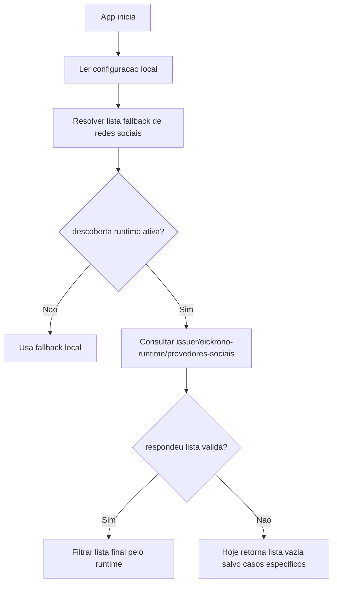

Leitura objetiva:

- a visibilidade das redes sociais no app hoje nao depende so do Flutter;
- depende tambem do que o runtime do Keycloak anuncia como habilitado;
- isso explica por que um provedor pode aparecer em `hml` mesmo sem fluxo UX
  totalmente refinado no app.

### 3.4 Fluxo tecnico de cadastro publico atual

#### 3.4.1 Diagrama principal

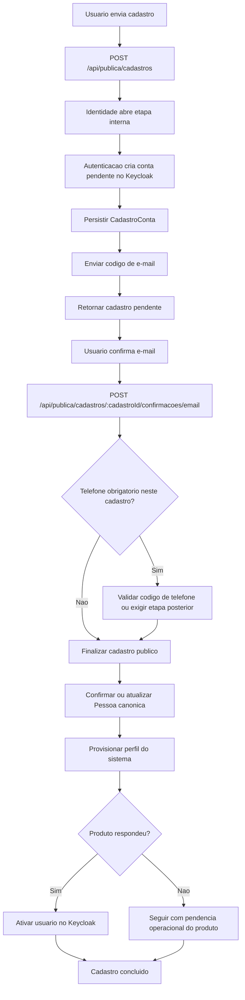

#### 3.4.2 O que a resposta publica diz hoje

Depois que e-mail e telefone estao resolvidos, a resposta publica do cadastro
hoje carrega:

- `statusPerfilSistema`
- `podeAutenticar`
- `proximoPasso`

Hoje, no codigo da `identidade`, a regra minima de resposta e:

- `podeAutenticar = email confirmado && etapa telefone concluida`
- `proximoPasso = LOGIN` quando e-mail e telefone ja terminaram

Fluxograma da resposta:

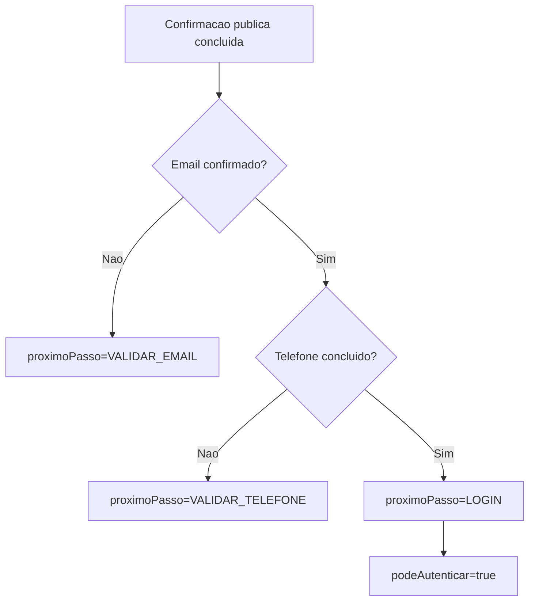

#### 3.4.3 Divergencia importante ja confirmada

Hoje existe uma divergencia objetiva:

- o cadastro confirmado pode responder `proximoPasso=LOGIN`;
- mas o login por senha da mesma borda publica ainda pode bloquear logo em
  seguida com `conta_nao_liberada` se o contexto local nao estiver em
  `LIBERADO`.

Ou seja:

- a resposta do cadastro e mais permissiva;
- o login por senha ainda e mais restritivo.

### 3.5 Fluxo tecnico de login por senha

#### 3.5.1 Diagrama principal

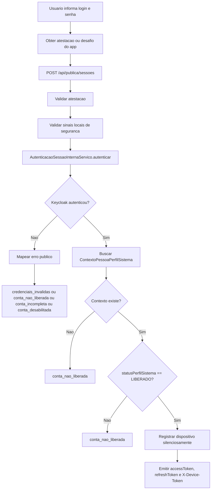

#### 3.5.2 O que a identidade exige hoje

No runtime atual da `identidade`, o login por senha so aceita:

- `statusPerfilSistema == LIBERADO`

Nao aceita hoje:

- `PENDENTE_LIBERACAO_PRODUTO`
- `ATIVO`

#### 3.5.3 O que o modulo novo da autenticacao ja aceita

No modulo novo de `autenticacao`, o login por senha ja esta mais flexivel:

- aceita `LIBERADO`
- aceita `PENDENTE_LIBERACAO_PRODUTO`

Mas o app ainda nao esta consumindo essa borda como caminho publico principal.

#### 3.5.4 O que o app faz com `conta_nao_liberada`

O app trata `conta_nao_liberada` assim:

- se houver `cadastroId` recuperavel, oferece retomada de validacao;
- se nao houver `cadastroId`, mostra a falha como bloqueio simples.

Fluxograma:

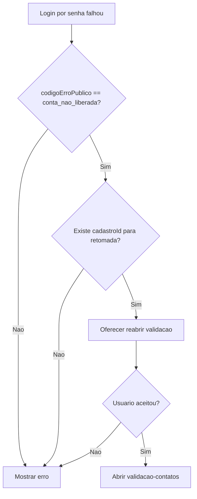

#### 3.5.5 Lista de contas recentes na tela de login

No comportamento tecnico adotado para o app, a lista de contas recentes da tela
de login nao fica renderizada permanentemente no corpo principal da tela.

Ela e exibida por um painel de apoio acionado pelo campo de login.

Fluxo tecnico adotado:

1. o operador toca o campo de e-mail/usuario;
2. o app verifica se existe pelo menos uma conta local elegivel persistida no
   dispositivo;
3. se nao existir nenhuma conta elegivel, o painel nao abre;
4. se existir pelo menos uma conta elegivel, o app abre um
   `showModalBottomSheet`;
5. se o operador tocar fora do painel, o modal e fechado;
6. se o operador selecionar uma conta, o app preenche o campo de login e fecha
   o painel;
7. se o operador tocar na remocao, o app abre o fluxo de confirmacao e
   reautenticacao antes de qualquer exclusao local.

Importante:

- contexto social pendente nao deve ser gatilho de abertura dessa lista;
- contexto social pendente deve usar componente proprio de decisao, separado da
  lista de contas recentes;
- se o runtime atual ainda misturar esses dois assuntos, isso deve ser tratado
  como divergencia a corrigir.

Fonte dos dados da lista:

- `contasLocaisDispositivoProvider`
- `CatalogoLocalContas`
- `ContaLocalDispositivo`

Regra tecnica de entrada na lista:

- a conta entra nessa lista quando uma sessao autenticada e registrada no
  catalogo local do dispositivo como conta realmente apta para uso no app;
- isso acontece no fluxo de persistencia local disparado apos autenticacao bem
  sucedida, via `registrarSessaoAutenticada(...)`, quando o app de fato esta
  fechando entrada de usuario e nao apenas agregando contexto social ao
  cadastro;
- autenticacao social usada apenas para foto de perfil, prefill (preenchimento inicial) de cadastro,
  agregacao de rede em cadastro em andamento ou vinculacao pendente nao deve
  criar conta recente no catalogo local;
- se o runtime atual estiver persistindo esse tipo de contexto incompleto como
  conta recente, isso deve ser tratado como bug funcional a corrigir.

Regra tecnica do preenchimento do campo ao selecionar item:

- o app usa `conta.identificadorParaPrefill`;
- o valor prioritario deve ser sempre o `usuario` da conta;
- o e-mail mascarado e apenas visual, nao o valor usado para prefill (preenchimento inicial).

Regra tecnica da mascara exibida na lista:

- a linha principal do item usa o `usuario` visivel;
- a linha secundaria usa `conta.emailMascarado`;
- a mascara do e-mail vem do proprio modelo `ContaLocalDispositivo`.

Regra tecnica da imagem do item:

- a primeira coluna do item usa a imagem de perfil local da conta, quando ela
  existir;
- se nao existir imagem de perfil vinculada, o item deve renderizar avatar
  simples com as iniciais da conta.

Algoritmo tecnico do e-mail mascarado:

1. normalizar o e-mail para minusculas;
2. separar parte local, dominio e sufixo;
3. mascarar parte local e dominio com a regra:
   - 1 caractere -> `*`
   - 2 caracteres -> primeira letra + `*`
   - 3 ou mais -> primeira letra + `***` + ultima letra;
4. preservar o sufixo do dominio.

Exemplo tecnico:

- `pedrosotc@gmail.com` -> `p***c@g***l.com`

Regra tecnica de fechamento:

- toque fora do `showModalBottomSheet` fecha o painel;
- escolha de conta fecha o painel;
- acao de remover conta nao deve excluir nada sem confirmacao explicita;
- a mensagem de confirmacao deve informar perda da conta local daquele
  dispositivo e dos dados locais ainda nao sincronizados com o servidor;
- se o operador confirmar a remocao, o app deve exigir login e senha para
  autorizar a limpeza do cache e do banco local daquela conta no aparelho;
- se o operador cancelar ou falhar na reautenticacao, nada deve ser apagado;
- ausencia de contas elegiveis impede a abertura.

### 3.6 Fluxo tecnico de login social

#### 3.6.1 O que o app faz primeiro

O login social e dividido em duas etapas:

1. criar a sessao central social;
2. garantir `X-Device-Token` depois.

#### 3.6.2 Diagrama da primeira etapa

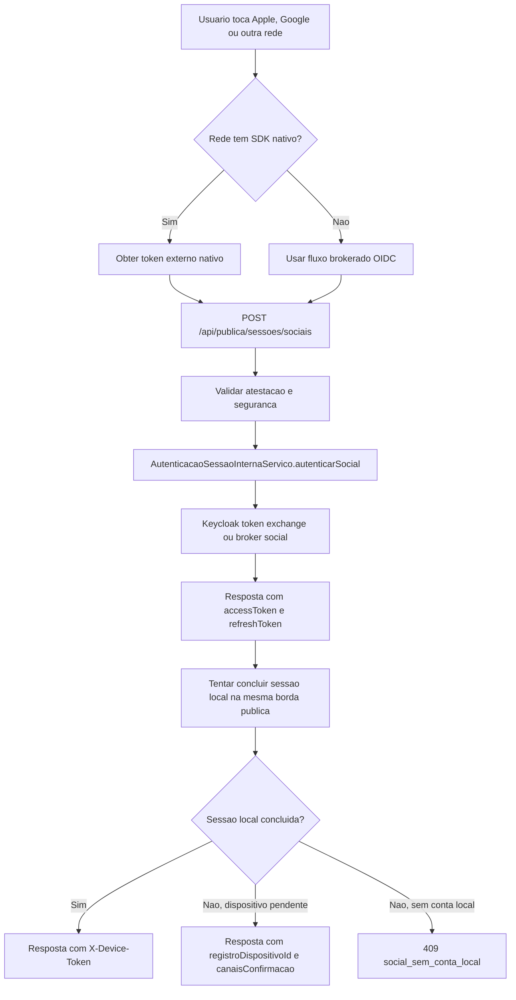

#### 3.6.3 O que a API publica de sessoes sociais devolve hoje

Hoje `POST /api/publica/sessoes/sociais` devolve:

- `accessToken`
- `refreshToken`
- `expiresIn`
- `tokenDispositivo` quando a sessao local consegue ser concluida na mesma chamada
- `registroDispositivoId`, `registroDispositivoExpiraEm`, `statusRegistroDispositivo` e `canaisConfirmacao`
  quando a autenticacao central deu certo, mas o dispositivo ainda precisa de confirmacao interativa

Entao o comportamento publico atual passou a ser:

- tentar fechar a sessao local ja no proprio login social;
- devolver sessao pronta quando isso for possivel;
- ou devolver estado de `dispositivo pendente` na mesma resposta publica, sem obrigar o app
  a descobrir isso em uma segunda chamada autenticada;
- `social_sem_conta_local` continua existindo quando a conta central autenticou, mas nao existe
  conta local pronta para aquele projeto.

#### 3.6.4 Colisao tecnica do broker nao e resposta funcional final

Quando o Keycloak devolver um erro tecnico como:

- `federated_identity_account_exists`
- `User already exists`
- ou outro conflito equivalente de broker/token exchange

o backend nao deve devolver imediatamente erro generico ao app.

Ele precisa classificar o caso funcionalmente.

Os subcasos minimos sao:

1. a conta local do projeto ja existe e a rede social ainda nao esta vinculada
   a ela
   - resposta correta: `social_sem_conta_local` com
     `acaoSugerida = ENTRAR_E_VINCULAR`

2. a identidade social ja pertence a outro usuario local
   - resposta correta: erro funcional explicito de conflito de vinculacao
   - nao deve oferecer `ENTRAR_E_VINCULAR`

3. o backend nao consegue provar qual conta local deveria receber o vinculo
   - resposta correta: conflito funcional explicito
   - nao deve abrir cadastro novo automaticamente

Em resumo:

- o erro tecnico do Keycloak e apenas a pista;
- a resposta publica do servidor precisa ser de negocio.

### 3.7 Fluxo tecnico de registro silencioso

#### 3.7.1 Diagrama principal

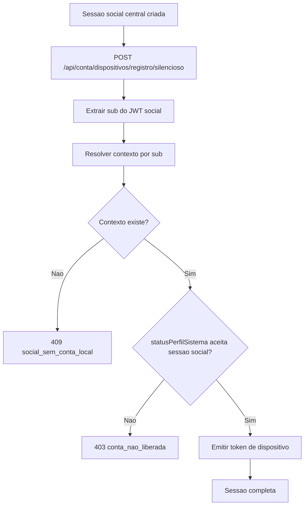

#### 3.7.2 Estados aceitos neste ponto

No `registro/silencioso`, a `identidade` aceita:

- `LIBERADO`
- `ATIVO`

Entao:

- login por senha aceita so `LIBERADO`;
- registro silencioso de sessao social aceita `LIBERADO` ou `ATIVO`.

#### 3.7.2.1 Fluxograma explicativo do comportamento atual

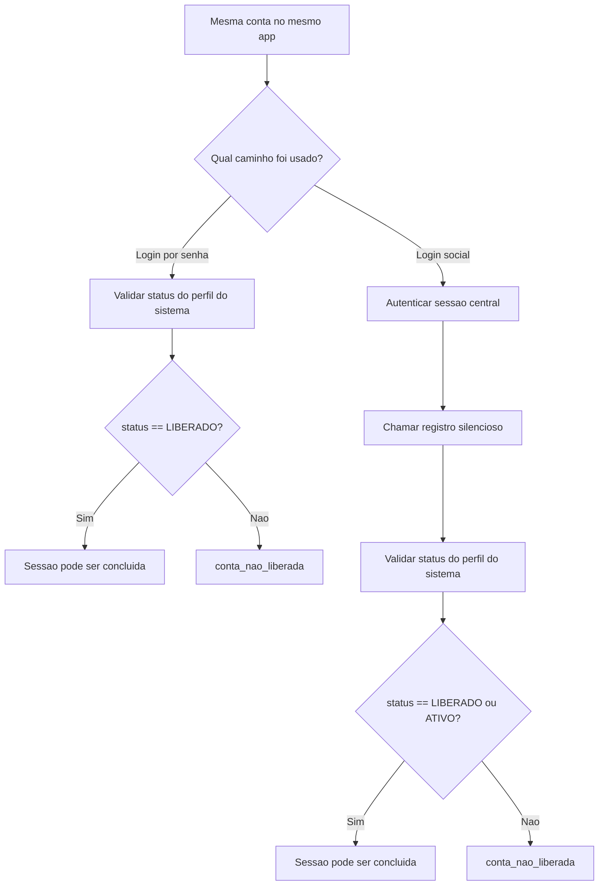

Leitura objetiva:

- a mesma conta pode ser tratada de formas diferentes dependendo do caminho;
- no estado atual, `ATIVO` pode passar pelo social e falhar na senha;
- isso e o tipo de divergencia que esta por tras da opiniao da secao `4.2`.

#### 3.7.3 Significado de `social_sem_conta_local`

Esse erro nao significa que o login social falhou.

Ele significa:

- a rede social autenticou com sucesso;
- a sessao central existe;
- mas ainda nao existe perfil do sistema no projeto atual para aquele `sub`.

Isso e o que aciona as UX de:

- abrir cadastro com dados sociais;
- ou entrar e vincular a uma conta local ja existente.

### 3.8 Ramo tecnico `social_sem_conta_local`

#### 3.8.1 Diagrama de decisao

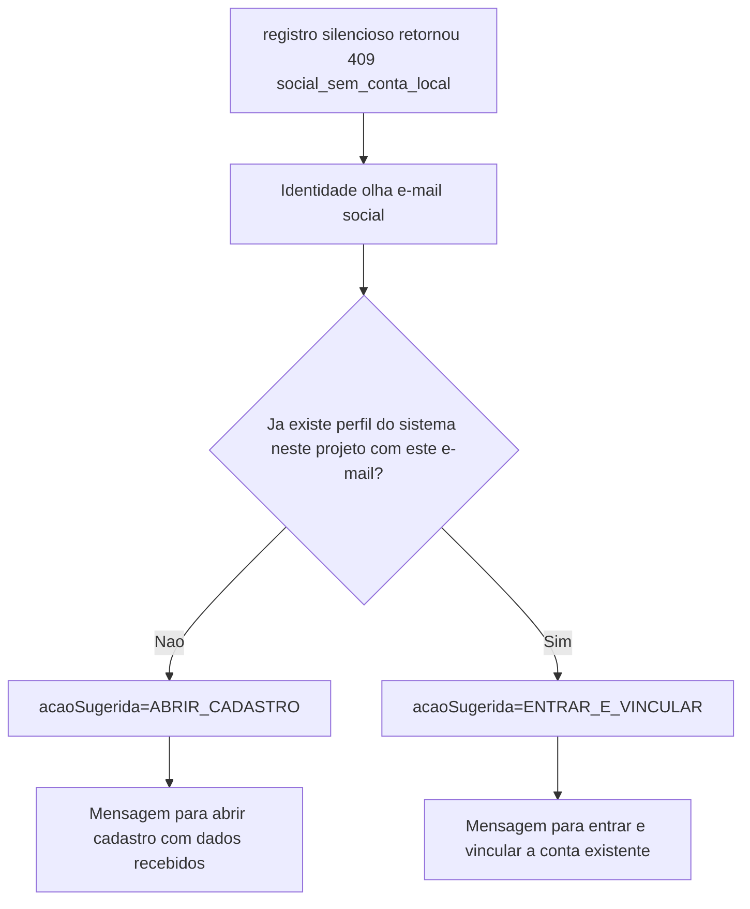

#### 3.8.2 Campos devolvidos nesse erro

Quando possivel, a `identidade` hoje tenta devolver no erro:

- `sub`
- `email`
- `acaoSugerida`
- `provedor`
- `identificadorExterno`
- `nomeUsuarioExterno`
- `nomeExibicaoExterno`
- `urlAvatarExterno`
- `loginSugerido`
- `emailContaExistente`

#### 3.8.3 Como o app reage hoje

Na tela de login:

- o app registra um contexto social pendente em memoria;
- encerra a sessao central temporaria localmente;
- mostra a UX para o operador decidir o proximo passo.

Na tela de foto de perfil e cadastro:

- o app reaproveita o mesmo mecanismo;
- se a conta ja existir e o `tokenDispositivo` vier, considera autenticacao
  concluida;
- se vier `social_sem_conta_local`, leva o contexto para o cadastro prefill (preenchimento inicial).

### 3.9 Fluxo tecnico social reaproveitado pela tela de foto de perfil

Hoje a tela de foto de perfil nao usa um fluxo social separado de backend.

Ela reaproveita o mesmo mecanismo de:

- sessao social publica;
- tentativa de `registro/silencioso`;
- interpretacao de `social_sem_conta_local`.

#### 3.9.1 Regra de comportamento da tela

Tecnicamente, a tela de foto de perfil e cadastro deve ser tratada como um
estado de `cadastro em andamento`.

Isso significa que o fluxo precisa se comportar igual independentemente de como
o cadastro foi aberto:

- se o operador entrou no cadastro diretamente, a tela começa vazia;
- se o operador entrou no cadastro vindo de uma autenticacao social anterior, a
  tela pode comecar com foto e rede ja prefilladas (preenchidas inicialmente);
- em ambos os casos, novas redes autenticadas precisam ser agregadas ao mesmo
  cadastro em andamento.

#### 3.9.2 Fluxograma correto para agregacao de redes no cadastro em andamento

O fluxo esperado para essa tela e este:

Fluxograma:

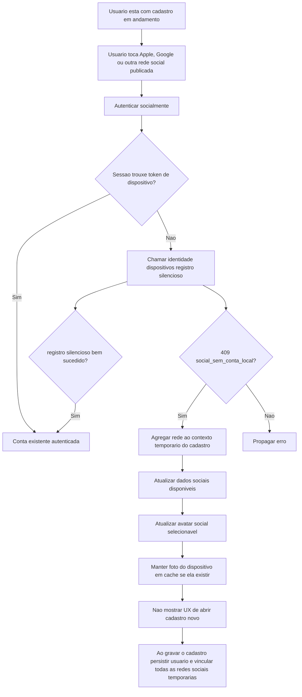

Leitura objetiva:

- autenticar socialmente na tela de foto de perfil nao significa concluir
  cadastro;
- significa tentar descobrir se ja existe conta local pronta ou se a rede deve
  alimentar cadastro e vinculacao;
- se o cadastro ja esta em andamento, a rede autenticada deve ser agregada a
  esse mesmo cadastro;
- portanto, a UX de "abrir cadastro novo" nao deveria aparecer nessa tela.

#### 3.9.3 Estado tecnico que a tela deveria preservar em memoria

Para esse comportamento ficar coerente, a tela deveria tratar explicitamente em
memoria pelo menos estes estados:

- lista de redes sociais temporariamente autenticadas neste cadastro;
- origem de avatar atualmente selecionada;
- foto do dispositivo em cache local;
- dados sociais disponiveis para prefill (preenchimento inicial);
- redes ja persistidas no backend, quando existirem;
- redes apenas temporarias, ainda nao persistidas.

#### 3.9.4 Desenho tecnico adotado para o avatar por iniciais

Para essa funcionalidade funcionar de forma previsivel, o componente de avatar
da tela de cadastro deve ser tratado como uma composicao de tres possiveis fontes
visuais, em ordem de prioridade:

1. foto explicitamente selecionada pelo operador;
2. monograma derivado do nome digitado;
3. icone generico padrao.

Em termos tecnicos, a tela precisaria manter pelo menos estes valores
derivados:

- `nomeDigitadoAtual`;
- `monogramaCalculado`;
- `origemAvatarSelecionada`;
- `urlAvatarSocialSelecionado`, quando houver;
- `arquivoAvatarDispositivoSelecionado`, quando houver.

Importante: nesta decisao o app **nao gera um arquivo de imagem** para o
monograma. O comportamento tecnico adotado e:

- nao gerar PNG;
- nao gerar JPEG;
- nao persistir bitmap;
- nao enviar imagem sintetica ao backend;
- renderizar o avatar por iniciais diretamente na UI, como um widget textual.

Em outras palavras:

- o monograma deve ser um `Container` circular com `Text` centralizado;
- nao deve ser uma imagem fisica gerada em disco.

A regra tecnica de renderizacao fica assim:

- se existe `arquivoAvatarDispositivoSelecionado`, renderizar a foto do
  dispositivo;
- senao, se existe `urlAvatarSocialSelecionado` para a origem selecionada,
  renderizar a foto social;
- senao, se existe `monogramaCalculado`, renderizar o monograma;
- senao, renderizar o icone generico.

#### 3.9.4.1 Estrutura tecnica adotada no Flutter

Uma implementacao coerente com o app atual fica assim:

- manter `_AvatarPreviewCadastro` como o widget principal do preview;
- adicionar um terceiro tipo em `_TipoAvatarCadastro`:
  - `monograma`
- adicionar um construtor correspondente em `_AvatarPerfilCadastro`:
  - `_AvatarPerfilCadastro.monograma({required String letras})`
- deixar `arquivoAvatarDispositivoSelecionado` e `urlAvatarSocialSelecionado`
  como fontes reais de imagem;
- usar `monogramaCalculado` apenas como fonte visual local.

Estrutura conceitual adotada:

```dart
enum _TipoAvatarCadastro { social, dispositivo, monograma }

class _AvatarPerfilCadastro {
  const _AvatarPerfilCadastro.social(...);
  const _AvatarPerfilCadastro.dispositivo(...);
  const _AvatarPerfilCadastro.monograma({required this.letras});
}
```

#### 3.9.4.2 Como o monograma deve ser renderizado

O monograma deve ser renderizado como:

- um `Container` circular;
- com o mesmo fundo base do placeholder atual;
- com as letras centralizadas no eixo vertical e horizontal;
- sem conversao para imagem;
- sem round-trip de backend.

Estrutura visual adotada:

- `Container` ou `DecoratedBox` circular;
- `Center`;
- `FittedBox` ou `AutoSize` equivalente somente se necessario;
- `Text` com as letras.

Exemplo conceitual:

```dart
Container(
  decoration: BoxDecoration(
    shape: BoxShape.circle,
    color: tema.colorScheme.surfaceContainerHigh,
    border: Border.all(color: corBorda),
  ),
  alignment: Alignment.center,
  child: Text(
    'TCP',
    textAlign: TextAlign.center,
    style: estiloMonograma,
  ),
)
```

#### 3.9.4.3 Tipografia adotada

A diretriz aqui e **nao inventar uma fonte nova** so para o monograma.
Ele deve usar a familia tipografica que o tema do app ja estiver usando.

No runtime atual do app, isso significa:

- iOS: `.SF Pro Text`
- Android e web: `Roboto`
- modo dislexia: `OpenDyslexic`

Portanto, o `Text` do monograma deve herdar a familia de fonte do `ThemeData`
atual, em vez de fixar uma familia propria.

Peso e estilo adotados:

- `fontWeight: FontWeight.w800`
- `height: 1`
- `letterSpacing: -0.5` para 2 letras
- `letterSpacing: -0.8` para 3 letras, se necessario

Cor adotada:

- usar a mesma cor de destaque que hoje colore o icone de pessoa do placeholder;
- isso mantem coerencia visual entre:
  - icone generico;
  - monograma;
  - estado sem foto.

#### 3.9.4.4 Regra responsiva de tamanho

Como o app ja trabalha com dois diametros principais nesta area:

- preview principal no topo: `172`
- circulos das fontes de avatar: `88`

a regra tecnica adotada e calcular o tamanho da fonte a partir do diametro do
componente, em vez de usar um valor absoluto fixo.

Regra adotada:

- para 2 letras:
  - `fontSize = diametro * 0.37`
- para 3 letras:
  - `fontSize = diametro * 0.32`

Isso produz, aproximadamente:

- preview do topo `172`:
  - 2 letras -> `63.6`
  - 3 letras -> `55.0`
- item da grade `88`:
  - 2 letras -> `32.6`
  - 3 letras -> `28.1`

Na pratica, o valor pode ser arredondado para:

- topo:
  - `64` para 2 letras
  - `56` para 3 letras
- grade:
  - `32` para 2 letras
  - `28` para 3 letras

#### 3.9.4.5 Comportamento visual e animacao

Para a troca nao parecer brusca, a regra tecnica adotada e:

- usar `AnimatedSwitcher` no preview principal;
- duracao curta:
  - `180ms` a `220ms`
- curva:
  - `Curves.easeOutCubic` ou equivalente

Trocas que devem animar:

- icone generico -> monograma;
- monograma -> foto real;
- foto real -> monograma;
- monograma -> icone generico.

O efeito esperado e:

- a tela responde em tempo real;
- sem parecer piscar;
- sem parecer re-renderizacao abrupta.

#### 3.9.5 Momento de atualizacao em tempo real

O comportamento tecnico esperado e simples:

- a cada alteracao relevante no campo de nome, recalcular o monograma;
- a atualizacao deve acontecer em tempo real no preview do topo;
- nao e necessario round-trip de backend para isso;
- a regra e puramente local da UI.

Isso significa que essa funcionalidade deve morar na camada de estado do
app, nao em `identidade` nem em `autenticacao`.

Implementacao adotada:

- observar o `TextEditingController` do campo `nome`;
- recalcular `monogramaCalculado` em `setState`, notifier ou provider local;
- atualizar apenas a regiao do preview, nao a tela inteira se isso puder ser
  evitado.

#### 3.9.6 Algoritmo tecnico adotado

Uma implementacao tecnica coerente segue estes passos:

1. resolver o locale atual da interface;
2. buscar a lista de tokens ignorados configurada para esse locale;
3. ler o valor atual do campo `nome`;
4. normalizar espacos repetidos;
5. quebrar o nome em tokens;
6. remover tokens vazios;
7. remover conectivos ou palavras de baixo valor semantico somente se eles
   estiverem na lista configurada para o locale atual;
8. se a lista final estiver vazia:
   - retornar `null`;
9. se existir uma unica palavra significativa:
   - retornar ate as duas primeiras letras em maiusculo;
10. se existirem duas palavras significativas:
   - retornar a primeira letra da primeira + a primeira letra da segunda;
11. se existirem tres ou mais palavras significativas:
   - retornar a primeira letra das tres primeiras palavras significativas;
12. renderizar o resultado em maiusculas.

Estrutura tecnica adotada para a regra por idioma:

- manter a lista de tokens ignorados como dado de internacionalizacao do app;
- nao hardcodar a lista diretamente dentro do widget;
- resolver isso por locale ativo, com fallback explicito.

Estrutura conceitual adotada:

```dart
const conectivosIgnoradosPorLocale = <String, Set<String>>{
  'pt': {'da', 'de', 'do', 'das', 'dos', 'e'},
  'en': {},
  'es': {},
};
```

Regra operacional dessa estrutura:

- se o locale existir no mapa, usar a lista declarada;
- se o locale nao existir ainda, usar lista vazia por padrao;
- ao adicionar um novo idioma ao app, revisar explicitamente se aquele idioma
  precisa de lista propria de exclusao.

Observacoes tecnicas adicionais:

- remover acentos so se isso ja estiver alinhado ao restante do app; caso
  contrario, manter as letras como digitadas;
- limitar o resultado final a no maximo 3 caracteres;
- nunca quebrar linha dentro do monograma.
- a comparacao dos tokens ignorados deve ser case-insensitive;
- a tokenizacao e a lista de exclusao devem ficar em uma camada reutilizavel do
  app, nao espalhadas em varios widgets.

#### 3.9.7 Observacoes tecnicas de UX

Para a UX nao parecer "nervosa", alguns cuidados tecnicos fazem sentido:

- o monograma nao deve aparecer antes de haver pelo menos um caractere util;
- a troca entre icone generico e monograma deve ser suave;
- a troca entre monograma e foto selecionada tambem deveria ser suave;
- o monograma e um fallback visual temporario, nao uma origem persistida de
  avatar;
- ele nao deveria sobrescrever foto social ou foto do dispositivo no payload
  salvo.
- o monograma deve ter `Semantics` proprio para acessibilidade, por exemplo:
  - `Avatar com iniciais T C`

#### 3.9.8 O que fica persistido e o que fica apenas em memoria

Nesta decisao, o monograma:

- existe apenas para renderizacao local da UI;
- nao precisa ser persistido como arquivo;
- nao precisa ser enviado ao backend como foto real;
- pode ser recalculado localmente sempre que a tela for aberta ou o nome mudar.

Em termos de responsabilidade tecnica:

- Flutter gera o visual;
- nao existe dependencia de backend;
- nao existe dependencia de servico de imagem;
- nao existe upload do monograma;
- a persistencia continua sendo reservada apenas para:
  - foto do dispositivo;
  - foto social real, quando houver.

### 3.10 Fluxo tecnico de recuperacao de senha

#### 3.10.1 Diagrama principal

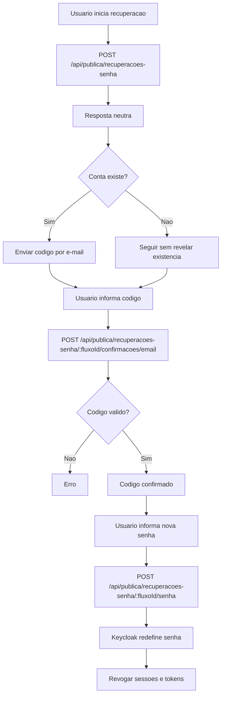

#### 3.10.2 O que ela nao faz hoje

A recuperacao de senha hoje nao:

- libera cadastro pendente;
- nao transforma `ATIVO` em `LIBERADO`;
- nao conclui onboarding de dispositivo;
- nao substitui a etapa de contexto local do projeto.

### 3.11 Refresh de sessao

Hoje tambem existe:

- `POST /api/publica/sessoes/refresh`

No runtime atual, o refresh:

- depende da sessao central;
- continua devolvendo `statusPerfilSistema`;
- continua exigindo coerencia minima com o contexto local;
- quando vier `refreshToken` valido, faltar `X-Device-Token`, existir `aplicacaoId` e vierem os
  dados do dispositivo, tenta recompor a sessao local automaticamente na propria borda publica.

Ele nao resolve sozinho:

- `social_sem_conta_local`;
- cadastro pendente;
- falta de `tokenDispositivo` quando nem a tentativa automatica de recomposicao conseguir concluir
  o dispositivo; nesse caso, devolve estado de `registroDispositivo` pendente para confirmacao.

### 3.12 Matriz tecnica de erros e comportamento do app

| Codigo | Onde nasce | Significado pratico | Reacao atual do app |
| --- | --- | --- | --- |
| `credenciais_invalidas` | login por senha | senha ou login invalidos | mostra erro simples |
| `conta_nao_liberada` | login por senha ou registro silencioso | conta central existe, mas contexto local ainda nao permite uso | pode oferecer retomada se houver `cadastroId`; caso contrario so bloqueia |
| `conta_incompleta` | mapeamento do login por senha | conta central ainda nao terminou configuracao minima | mostra erro |
| `conta_desabilitada` | mapeamento do login por senha | conta bloqueada ou desabilitada | mostra erro |
| `conta_pendente_redefinir_senha` | login por senha | conta precisa regularizar senha | app oferece fluxo de regularizacao |
| `social_sem_conta_local` | `registro/silencioso` | rede social autenticou, mas nao existe perfil do sistema pronto para este projeto | app abre fluxo de cadastro ou entrar e vincular |
| `falha_rede` | qualquer etapa | conectividade | app mostra erro de rede |

### 3.13 Divergencias abertas e erros estruturais confirmados

#### 3.13.1 Host operacional ainda pode usar alias `id-*`

A chave canonica do app ja e `servicos.autenticacao.baseUrl`, mas em alguns
ambientes o hostname configurado ainda usa o alias operacional `id-*`.

Consequencia:

- a linguagem arquitetural correta ja e `autenticacao`;
- mas ainda podem existir nomes legados de host ate o rollout final de DNS e
  runtime.

#### 3.13.2 Cadastro pode dizer `LOGIN`, mas login por senha ainda bloquear

Hoje existe contradicao entre:

- resposta de confirmacao de cadastro;
- gate real do login por senha.

Isso precisa ser uniformizado.

#### 3.13.3 Login por senha e sessao social aceitam estados diferentes

Hoje:

- login por senha exige `LIBERADO`;
- sessao social com `registro/silencioso` aceita `LIBERADO` ou `ATIVO`.

Isso e outra divergencia funcional real.

#### 3.13.4 Lista de redes sociais depende do runtime OIDC

Hoje um provedor pode aparecer no app porque:

- o runtime do Keycloak o anunciou como habilitado;
- mesmo que a UX do app ou a operacao do ambiente ainda nao estejam fechadas.

#### 3.13.5 O `X-Device-Token` nao nasce sempre no mesmo passo

Hoje:

- no login por senha, a borda publica ja tenta fechar tudo na mesma chamada;
- no login social, a sessao central vem primeiro e o `tokenDispositivo` vem
  depois, via `registro/silencioso`.

Isso explica boa parte da complexidade atual.

## 4. Diretrizes de consolidacao e decisoes adotadas

Esta secao nao descreve o runtime atual como fato observado. Ela consolida:

- decisoes de produto ja adotadas;
- diretrizes de consolidacao do fluxo;
- criterios de manutencao documental e contratual.

### 4.1 Decisao adotada: a borda publica do app fica em `autenticacao`, com migracao faseada

Decisao fechada neste projeto:

- o app deve chamar uma unica borda publica efetiva;
- essa borda publica final fica em `autenticacao`;
- `identidade` deixa de ser superficie publica para app e site;
- a transicao sera feita por migracao faseada, sem fingir que o runtime atual
  ja chegou no estado final.

Motivos da decisao:

- divergencia de regra entre resposta do cadastro e gate do login;
- duplicacao de validacoes publicas;
- confusao sobre "quem manda" no fluxo.

#### 4.1.1 O que significa "borda publica do app"

Aqui, "borda publica do app" significa:

- o conjunto de endpoints que o app movel pode chamar diretamente;
- o conjunto de endpoints que um site publico do ecossistema poderia chamar
  diretamente;
- a superficie externa que fica em contato com cliente final.

No estado alvo adotado, essa borda publica:

- deve ficar concentrada em `autenticacao`;
- nao deve ficar espalhada entre `autenticacao` e `identidade`;
- nao deve permitir que app ou site cliente conversem diretamente com
  `identidade`.

#### 4.1.2 O que deve ser proibido no estado alvo

No estado alvo, estes caminhos deixam de ser aceitaveis:

- `app -> identidade`
- `site publico -> identidade`
- `frontend cliente -> identidade`

No estado alvo, a relacao correta fica assim:

- `app -> autenticacao`
- `site publico -> autenticacao`
- `autenticacao -> identidade` por backchannel interno
- `autenticacao -> backend do produto` por backchannel interno
- `autenticacao -> Keycloak` por integracao interna

#### 4.1.3 O que estou chamando de backchannel aqui

Backchannel, neste contexto, significa:

- chamada servidor para servidor;
- sem app movel na ponta;
- sem browser do cliente na ponta;
- sem frontend do cliente consumindo a rota diretamente;
- com autenticacao interna do ecossistema.

Exemplos de autenticacao interna aceitavel nesse desenho:

- `mTLS`;
- `client_credentials`;
- `JWT interno`;
- `secret interno` temporario, se ainda houver transicao.

#### 4.1.4 Explicacao funcional

Funcionalmente, o operador do app nao deveria precisar "sentir" que existem
dois backends publicos principais.

Para ele, deveria existir apenas:

- "a API do app"

e essa API deveria responder de forma coerente para:

- cadastro;
- confirmacao;
- login;
- login social;
- refresh;
- vinculacao social;
- foto de perfil;
- revogacao e politica de dispositivo.

Se essas respostas publicas ficam espalhadas, aparecem situacoes como:

- o cadastro manda ir para login, mas o login bloqueia;
- o login por senha segue uma regra;
- o login social segue outra;
- a tela de foto de perfil interpreta uma autenticacao social com semantica
  diferente da tela de login.

#### 4.1.5 Explicacao tecnica

Tecnicamente, o problema historico era que:

- o app apontava para `servicos.identidade.baseUrl`;
- a `identidade` publicava parte importante da superficie externa;
- ao mesmo tempo, `autenticacao` ja concentra boa parte do ownership real de
  credencial, sessao central, refresh, federacao social e estado central.

Isso faz surgir:

- contratos publicos duplicados ou quase duplicados;
- validacoes publicas espalhadas;
- semanticas diferentes para fluxos vizinhos;
- dificuldade de saber qual servico e o dono canonico da decisao.

#### 4.1.6 Casos de uso que ilustram o problema

##### Caso 1. Cadastro confirmado

Fluxo esperado pelo operador:

1. confirma o cadastro;
2. recebe orientacao para login;
3. tenta entrar;
4. o login funciona.

Problema que pode acontecer hoje:

1. a confirmacao de cadastro responde `proximoPasso=LOGIN`;
2. o operador entende que a conta esta pronta;
3. depois o login por senha ainda pode bloquear;
4. a experiencia parece contraditoria.

##### Caso 2. Login social

Fluxo esperado pelo operador:

1. toca `Apple` ou `Google`;
2. autentica;
3. entra.

Problema tecnico historico:

1. uma parte da sessao nasce na borda publica;
2. outra parte nasce em `registro/silencioso`;
3. uma parte do fluxo ainda depende de `identidade` como borda externa;
4. o app precisa conhecer detalhes demais da composicao interna.

##### Caso 3. Vinculos sociais e avatar

Fluxo esperado pelo operador:

1. entra no app;
2. gerencia suas redes sociais e avatar;
3. o sistema parece uma unica API consistente.

Problema tecnico atual:

1. o app chamava rotas `identidade/vinculos-sociais`;
2. isso expunha `identidade` diretamente ao cliente;
3. a camada publica final nao ficava centralizada.

#### 4.1.7 Migracao funcional e tecnica adotada

O desenho alvo e este:

1. o app fala somente com `autenticacao`;
2. `autenticacao` passa a publicar toda a superficie externa necessaria;
3. `identidade` passa a receber apenas chamadas internas;
4. os contratos externos ficam concentrados num unico dono publico.

Sequencia adotada para a migracao:

1. duplicar em `autenticacao` todos os endpoints que o app ainda busca em
   `identidade`;
2. fazer esses endpoints chamarem `identidade` por backchannel;
3. trocar o cliente Flutter para apontar apenas para `autenticacao`;
4. remover do app o uso canônico de `servicos.identidade.baseUrl`;
5. congelar a exposicao publica de `identidade` para uso do app;
6. manter teste de regressao garantindo que nenhum cliente movel aponta mais
   para `/identidade/...`.

#### 4.1.8 Tabela endpoint por endpoint da migracao

##### Superficie publica

| Endpoint atual usado pelo app | Endpoint-alvo exposto por `autenticacao` | Owner final do contrato publico | Precisa proxy/backchannel? | Pode remover da exposicao de `identidade` quando? |
| --- | --- | --- | --- | --- |
| `POST /api/publica/cadastros` | `POST /api/publica/cadastros` | `autenticacao` | Sim, se ainda depender de `identidade` internamente | Quando o app inteiro estiver apontando para `autenticacao` |
| `GET /api/publica/cadastros/usuarios/disponibilidade` | `GET /api/publica/cadastros/usuarios/disponibilidade` | `autenticacao` | Nao necessariamente; a regra ja tende a ser central | Quando nenhum cliente publico usar mais a rota da `identidade` |
| `POST /api/publica/cadastros/:cadastroId/confirmacoes/email` | `POST /api/publica/cadastros/:cadastroId/confirmacoes/email` | `autenticacao` | Sim, durante a transicao | Quando o app e sites migrarem |
| `POST /api/publica/cadastros/:cadastroId/confirmacoes/telefone` | `POST /api/publica/cadastros/:cadastroId/confirmacoes/telefone` | `autenticacao` | Sim, durante a transicao | Quando o app e sites migrarem |
| `GET /api/publica/cadastros/:cadastroId/status` | `GET /api/publica/cadastros/:cadastroId/status` | `autenticacao` | Sim, durante a transicao | Quando o app migrar |
| `POST /api/publica/sessoes` | `POST /api/publica/sessoes` | `autenticacao` | Nao, este e o dono natural | Quando o app migrar |
| `POST /api/publica/sessoes/sociais` | `POST /api/publica/sessoes/sociais` | `autenticacao` | Sim, se ainda precisar consultar `identidade` para contexto local | Quando o app migrar e a orquestracao estiver toda em `autenticacao` |
| `POST /api/publica/sessoes/refresh` | `POST /api/publica/sessoes/refresh` | `autenticacao` | Nao, este e o dono natural | Quando o app migrar |
| `POST /api/publica/recuperacoes-senha` | `POST /api/publica/recuperacoes-senha` | `autenticacao` | Nao, este e o dono natural | Quando o app migrar |
| `POST /api/publica/recuperacoes-senha/:fluxoId/confirmacoes/email` | `POST /api/publica/recuperacoes-senha/:fluxoId/confirmacoes/email` | `autenticacao` | Nao, este e o dono natural | Quando o app migrar |
| `POST /api/publica/recuperacoes-senha/:fluxoId/senha` | `POST /api/publica/recuperacoes-senha/:fluxoId/senha` | `autenticacao` | Nao, este e o dono natural | Quando o app migrar |
| `DELETE /api/publica/sessoes/contextos-sociais-pendentes/:id` | `DELETE /api/publica/sessoes/contextos-sociais-pendentes/:id` | `autenticacao` | Sim, se o armazenamento ainda estiver fora dela | Quando o app migrar |

##### Superficie autenticada

| Endpoint atual usado pelo app | Endpoint-alvo exposto por `autenticacao` | Owner final do contrato publico | Precisa proxy/backchannel? | Pode remover da exposicao de `identidade` quando? |
| --- | --- | --- | --- | --- |
| `POST /identidade/dispositivos/registro/silencioso` | `POST /api/conta/dispositivos/registro/silencioso` | `autenticacao` | Sim, durante a transicao | Quando o app nao chamar mais `/identidade/dispositivos/...` |
| `POST /identidade/dispositivos/registro` | `POST /api/conta/dispositivos/registro` | `autenticacao` | Sim, durante a transicao | Quando o app migrar |
| `POST /identidade/dispositivos/registro/:id/confirmacao` | `POST /api/conta/dispositivos/registro/:id/confirmacao` | `autenticacao` | Sim | Quando o app migrar |
| `POST /identidade/dispositivos/registro/:id/reenviar` | `POST /api/conta/dispositivos/registro/:id/reenviar` | `autenticacao` | Sim | Quando o app migrar |
| `POST /identidade/dispositivos/revogar` | `POST /api/conta/dispositivos/revogar` | `autenticacao` | Sim, se a logica ainda estiver em `identidade` | Quando o app migrar |
| `GET /identidade/dispositivos/offline/politica` | `GET /api/conta/dispositivos/offline/politica` | `autenticacao` | Sim, se a politica ainda for servida por `identidade` | Quando o app migrar |
| `POST /identidade/dispositivos/offline/eventos` | `POST /api/conta/dispositivos/offline/eventos` | `autenticacao` | Sim | Quando o app migrar |
| `GET /identidade/vinculos-sociais` | `GET /api/conta/redes-sociais` | `autenticacao` | Sim, durante a transicao | Quando o app migrar |
| `POST /identidade/vinculos-sociais/:provedor` | `POST /api/conta/redes-sociais/:provedor` | `autenticacao` | Sim | Quando o app migrar |
| `POST /identidade/vinculos-sociais/:provedor/sincronizacao` | `POST /api/conta/redes-sociais/:provedor/sincronizacao` | `autenticacao` | Sim | Quando o app migrar |
| `DELETE /identidade/vinculos-sociais/:provedor` | `DELETE /api/conta/redes-sociais/:provedor` | `autenticacao` | Sim | Quando o app migrar |
| `PUT /identidade/vinculos-sociais/avatar-preferido` | `PUT /api/conta/avatar-preferido` | `autenticacao` | Sim | Quando o app migrar |

#### 4.1.9 Resultado esperado da migracao

Quando essa migracao terminar:

- o app nao conhece mais `identidade`;
- o site publico nao conhece mais `identidade`;
- `identidade` continua existindo, mas como servico interno;
- a publicacao externa de contratos de autenticacao fica concentrada em
  `autenticacao`;
- qualquer chamada a `identidade` passa a ser exclusivamente interna ao
  ecossistema Eickrono.

### 4.2 Decisao adotada: login por senha e login social compartilham a mesma politica de status

Hoje senha e social ainda aceitam estados diferentes no runtime atual, mas a
decisao adotada neste projeto e uniformizar essa politica, porque o operador
nao enxerga sentido em:

- a conta parecer pronta num caminho;
- e parecer bloqueada em outro.

#### 4.2.1 O que isso quer dizer na pratica

Hoje o exemplo mais claro e este:

- a conta possui `statusPerfilSistema = ATIVO`;
- se o operador tentar entrar por senha, o caminho publico atual bloqueia;
- se o operador tentar entrar por rede social e depois passar pelo
  `registro/silencioso`, o mesmo estado pode ser aceito.

Entao, para o mesmo usuario, no mesmo aplicativo, existem duas leituras
publicas diferentes de prontidao da conta:

- uma diz "ainda nao pode entrar";
- outra diz "pode seguir".

Funcionalmente isso e ruim porque o operador nao enxerga:

- "status do login por senha";
- "status do login social".

Ele enxerga apenas:

- "minha conta neste app".

#### 4.2.2 Exemplo concreto

Imagine este caso:

- conta central valida;
- perfil do sistema ja existe;
- `statusPerfilSistema = ATIVO`.

Resultado atual:

1. se o operador entrar com senha:
   - o backend valida o status;
   - como o login por senha da borda atual aceita apenas `LIBERADO`, o acesso
     pode ser bloqueado.

2. se o operador entrar com `Apple` ou `Google`:
   - a autenticacao social central pode ser criada;
   - depois o `registro/silencioso` aceita `LIBERADO` ou `ATIVO`;
   - a sessao pode ser concluida.

Entao o problema que eu quis apontar e exatamente este:

- a mesma conta pode parecer bloqueada num caminho;
- e pronta em outro.

#### 4.2.3 Tabela comparativa

| Tema | Login por senha hoje | Login por rede social autenticada hoje | Diretriz de unificacao | Aplicacao adotada neste projeto |
| --- | --- | --- | --- | --- |
| Status `LIBERADO` | aceita | aceita | manter como status plenamente apto para login e sessao pronta | Aprovar sem ressalvas |
| Status `ATIVO` | bloqueia | aceita via `registro/silencioso` | tratar `ATIVO` como apto temporariamente nos dois caminhos durante a migracao, porque o proprio runtime atual ja prova que ele e operacionalmente utilizavel no social; em paralelo, parar de expor `ATIVO` como status publico final e convergir esse estado para `LIBERADO` | Aceitar `ATIVO` nos dois caminhos agora e programar sua extincao como status publico |
| Status `PENDENTE_LIBERACAO_PRODUTO` | na `identidade` publica atual tende a bloquear | depende do tronco seguinte; hoje nao e a mesma regra do login por senha | permitir login central nos dois caminhos, mas nao prometer disponibilidade plena do produto; a restricao deve existir apenas nas operacoes que realmente dependem do backend do produto | Permitir sessao central e postergar o bloqueio para o momento de uso do produto |
| Fonte da regra de prontidao | gate publico da `identidade` | combinacao de sessao social + `registro/silencioso` | extrair uma unica regra canônica de "sessao apta para uso" e aplicá-la em senha, social, refresh e registro silencioso; essa regra deve morar na borda pública final, idealmente `autenticacao` | Centralizar em `autenticacao` |
| Percepcao do operador | "senha nao entrou" | "rede social entrou" | fazer ambos os caminhos retornarem a mesma decisao funcional para o mesmo estado, inclusive com mensagens de erro equivalentes e mesmas opcoes de retomada | Unificar mensagens e comportamento visivel |

#### 4.2.4 Possivel solucao de implementacao e unificacao

Uma forma simples de unificar isso seria:

1. escolher uma politica unica de status aceitos para "sessao pronta para uso";
2. aplicar essa mesma politica:
   - no login por senha;
   - no login social;
   - no `registro/silencioso`;
   - e, idealmente, no refresh quando ele depender de contexto local.

Tecnicamente, isso pode ser feito de duas maneiras:

- extrair uma regra compartilhada para um componente unico de validacao de
  prontidao do perfil do sistema;
- ou mover essa decisao toda para a borda publica canônica, evitando que cada
  caminho faca sua propria interpretacao.

Funcionalmente, o objetivo da unificacao seria este:

- se uma conta esta "pronta para entrar", ela deve parecer pronta em todos os
  caminhos;
- se uma conta ainda "nao esta pronta para entrar", ela deve parecer bloqueada
  em todos os caminhos;
- o operador nao deveria precisar descobrir por tentativa que senha e rede
  social usam leituras diferentes do mesmo estado.

#### 4.2.5 Decisao adotada para este projeto

Decisao fechada neste projeto:

1. `LIBERADO`
   - continua aceito em todos os caminhos;
2. `ATIVO`
   - passa a ser aceito em todos os caminhos durante a migracao;
   - deixa de ser exposto como destino semantico final do contrato publico;
   - deve ser tratado como estado legado em convergencia para `LIBERADO`;
3. `PENDENTE_LIBERACAO_PRODUTO`
   - passa a permitir login central em todos os caminhos;
   - nao garante uso pleno do produto;
   - eventuais restricoes ficam para as operacoes que realmente precisarem do
     backend do produto;
4. regra de prontidao
   - sai de varios pontos espalhados;
   - passa a existir em um unico avaliador canônico;
5. dono da decisao
   - passa a ser a borda publica final, idealmente `autenticacao`.

O motivo da minha recomendacao e este:

- ela reduz contradicao imediata de UX;
- ela respeita a decisao ja tomada de nao bloquear login central apenas por
  pendencia do produto;
- ela aproveita o fato de que `ATIVO` ja esta sendo tratado como utilizavel em
  parte do runtime;
- ela cria um caminho objetivo para eliminar o status legado `ATIVO` da
  superficie publica sem quebrar o ecossistema no meio da migracao.

### 4.3 Decisao adotada: o app deve enxergar um unico fechamento de sessao

Decisao fechada neste projeto:

- o app nao deve considerar que "entrou no app" apenas porque a autenticacao
  central deu certo;
- o app so deve considerar sessao pronta quando o fechamento da sessao local do
  projeto tambem estiver concluido;
- os passos internos que existirem entre autenticacao central e emissao de
  `X-Device-Token` devem ficar escondidos atras da borda publica final,
  preferencialmente `autenticacao`.

Isso significa, na pratica:

- no login, o app deve enxergar um unico resultado publico:
  - sessao pronta para uso;
  - ou erro/retomada/bloqueio;
- no cadastro e na tela de foto de perfil, autenticacao social bem-sucedida nao
  significa necessariamente "usuario logado no app";
- nesses contextos, a autenticacao social pode servir apenas para:
  - agregar rede ao cadastro;
  - preencher dados;
  - fornecer avatar;
  - ou preparar futura vinculacao.

O contexto desta observacao e **fechamento de sessao do app**, nao cadastro em
geral.

Mais especificamente, esta observacao trata da pergunta:

- "em que momento o app pode considerar que a sessao esta realmente pronta para
  uso neste projeto?"

#### 4.3.1 Onde este problema aparece hoje

Este problema aparece hoje principalmente em fluxos em que:

- a autenticacao central pode nascer antes;
- e o `X-Device-Token` vem depois.

Na pratica, isso ocorre nestes casos:

1. login social pela tela de login;
2. reaproveitamento de sessao social na tela de foto de perfil;
3. autenticacao social dentro de cadastro em andamento, quando o app tenta
   descobrir se aquela rede ja fecha sessao local ou se apenas alimenta
   cadastro/vinculacao.

Ou seja:

- o problema aparece quando existe autenticacao social;
- e o app ainda precisa fechar o contexto local do projeto depois.

#### 4.3.2 Onde este problema nao e o foco principal

Esta observacao **nao** fala principalmente de:

- cadastro puro por formulario, antes de qualquer autenticacao;
- validacao de e-mail;
- validacao de telefone;
- preenchimento simples de dados cadastrais sem sessao central envolvida.

Nesses casos, o problema dominante e outro:

- onboarding;
- validacao;
- persistencia;
- ou prefill (preenchimento inicial) de cadastro.

Nao e o `X-Device-Token`.

#### 4.3.3 Diferenca entre login por senha e login social no runtime atual

No login por senha, o runtime atual tende a parecer mais linear para o app:

- o app envia login e senha;
- a borda publica ja tenta autenticar;
- a mesma chamada ja tenta fechar o contexto do projeto;
- quando da certo, a resposta ja vem como sessao praticamente completa.

No login social, o runtime historico nao era assim:

1. o app autentica centralmente via `POST /api/publica/sessoes/sociais`;
2. recebe `accessToken` e `refreshToken`;
3. depois ainda precisava chamar
   `POST /api/conta/dispositivos/registro/silencioso`;
4. so depois disso a sessao do app podia ficar realmente completa.

No runtime consolidado atual, a borda publica de `autenticacao` ja tenta fechar
isso no mesmo fluxo e so devolve:

- sessao pronta;
- `registroDispositivo` pendente de confirmacao;
- ou bloqueio final.

Entao a critica aqui nao e mais "o app sempre faz duas chamadas". Ela e:

- historicamente o social foi mais fragmentado que a senha;
- e o contrato publico ainda precisa deixar isso muito claro para evitar
  regressao.

- **isso acontece principalmente nos fluxos sociais e nos reaproveitamentos de
  sessao social**, e por isso o social hoje parece mais fragmentado que a
  senha.

#### 4.3.4 Exemplo completo do problema no login social

Exemplo concreto:

1. o operador toca `Google`;
2. `POST /api/publica/sessoes/sociais` autentica com sucesso;
3. a borda publica tenta concluir a sessao local do projeto;
4. se tudo der certo, o app recebe a sessao pronta;
5. se o dispositivo ainda exigir confirmacao, a mesma borda devolve
   `registroDispositivo` pendente;
6. se a conclusao local falhar com:
   - `social_sem_conta_local`;
   - `conta_nao_liberada`;
   - ou erro de rede;
7. o operador percebe uma contradicao:
   - "mas a rede social nao tinha acabado de autenticar com sucesso?"

Ou seja:

- a autenticacao central pode ter dado certo;
- mas a sessao do app ainda nao ficou completa.

#### 4.3.5 Exemplo do mesmo problema na tela de foto de perfil

Na tela de foto de perfil, o problema aparece de forma parecida, mas com outra
intencao funcional.

Ali o operador nao esta necessariamente tentando "entrar". Muitas vezes ele
esta tentando:

- agregar uma rede social ao cadastro;
- ou usar a foto daquela rede;
- ou descobrir se aquela rede ja casa com uma conta local pronta.

Mesmo assim, por baixo, o app ainda pode passar por:

1. autenticacao social central;
2. tentativa de `registro/silencioso`;
3. decisao entre:
   - sessao local pronta;
   - `social_sem_conta_local`;
   - ou contexto para cadastro/vinculacao.

Entao a confusao aqui e:

- a mesma engrenagem de "fechar sessao local" aparece tambem numa tela cuja
  intencao primaria nem sempre e login.

#### 4.3.6 O problema tecnico da separacao atual

O problema tecnico da separacao atual e este:

- a primeira chamada responde sobre a autenticacao central;
- a segunda chamada responde sobre o contexto local do projeto;
- entao uma parte do estado da sessao nasce numa borda e a outra parte nasce em
  outra;
- isso aumenta a chance de divergencia entre:
  - o que o app acha que ja conseguiu;
  - o que o backend ainda considera pendente.

#### 4.3.7 Forma adotada de leitura funcional

A leitura funcional adotada neste projeto fica assim:

- na tela de login:
  - autenticacao social so vira "login concluido" quando a sessao local do app
    estiver realmente pronta;
- na tela de cadastro e na tela de foto de perfil:
  - autenticacao social bem-sucedida pode existir sem representar login no app;
  - nesse caso, ela representa contexto social reutilizavel para cadastro,
    avatar ou vinculacao.

Entao a semantica fechada e esta:

- **login central bem-sucedido nao basta, sozinho, para significar sessao do
  app concluida**;
- **cadastro e foto de perfil podem reaproveitar autenticacao social sem que
  isso signifique entrada no app**.

#### 4.3.8 Implementacao publica alvo

No estado alvo adotado:

1. o app chama a borda publica final;
2. a borda publica final executa internamente quantas etapas forem necessarias;
3. o app recebe so o resultado consolidado:
   - sessao pronta;
   - ou erro/bloqueio/retomada;
   - ou contexto social para cadastro/vinculacao quando a tela nao for login.

Em outras palavras:

- a complexidade interna pode continuar existindo durante a migracao;
- o app nao deve mais ser o orquestrador visivel dessa complexidade.

### 4.4 Decisao adotada: login e cadastro compartilham o mesmo tronco tecnico social, mas nao a mesma UX final

Hoje o mesmo mecanismo social aparece em telas diferentes com intencoes
diferentes:

- entrar;
- vincular;
- preencher cadastro;
- escolher avatar.

Decisao adotada neste projeto:

- o backend pode continuar reaproveitando o mesmo tronco tecnico social;
- mas a UX final da tela de login nao deve ser reutilizada automaticamente na
  tela de cadastro e foto de perfil.

O modelo funcional fechado fica assim:

- no login, autenticacao social responde a pergunta "esta rede social sera
  usada para entrar agora ou para iniciar meu cadastro?";
- no cadastro em andamento, autenticacao social responde a pergunta "quais
  redes eu quero agregar a este cadastro atual?".

Consequencia pratica desta decisao:

- a tela de cadastro e foto de perfil nao deve reaproveitar a mesma UX de
  decisao usada na tela de login quando aparece `social_sem_conta_local`;
- o ramo tecnico pode ser reaproveitado;
- a UX final deve ser diferente em cada contexto;
- dentro de cadastro em andamento, autenticacao social deve significar
  agregacao ao cadastro atual, e nao abertura de novo cadastro.

### 4.5 Manutencao disciplinada do apendice de contratos

Esta observacao ja nao e mais um "faltou criar". O apendice de contratos ja foi
incorporado neste guia na secao `5. Apendice de contratos`.

Entao, neste ponto, o problema deixa de ser "criar um apendice" e passa a ser
"impedir que o apendice fique desatualizado em relacao ao runtime real".

#### 4.5.1 O que ja foi resolvido

Hoje este guia ja contem:

- payloads de request;
- payloads de response;
- shape de erro publico e autenticado;
- exemplos de resposta para retomada, vinculacao e `social_sem_conta_local`;
- observacoes de compatibilidade como `usuarioId` e `statusUsuario`.

Ou seja: a necessidade funcional que antes estava em aberto ja foi atendida.

#### 4.5.2 O problema que sobra de verdade

O risco que permanece nao e mais ausencia de documentacao. O risco agora e
drift de contrato.

Aqui, drift de contrato significa:

- o controller muda;
- o DTO muda;
- o codigo de erro muda;
- a UX passa a depender de um campo novo;
- mas a secao `5` continua com exemplo antigo.

Quando isso acontece, o guia deixa de ser fonte confiavel e volta a obrigar
leitura direta do codigo ou tentativa e erro em `dev`/`hml`.

#### 4.5.3 Regra pratica adotada

Se este guia continuar sendo o documento principal do fluxo, a regra adotada e
simples:

- toda alteracao de contrato publico ou autenticado deve atualizar a secao `5`
  no mesmo PR ou no mesmo commit documental da mudanca;
- nenhuma mudanca de endpoint publico deve ser considerada "pronta" sem revisar
  o apendice correspondente;
- mudancas puramente internas de backchannel so precisam atualizar o apendice
  se alterarem reflexo visivel para app, site ou UX.

#### 4.5.4 Tarefa concreta de implementacao e manutencao

Para nao deixar isso num nivel abstrato, a manutencao correta do apendice pode
seguir este roteiro:

1. Identificar se a alteracao mexe em contrato externo.
   Se a mudanca atingir endpoint consumido por app, site, cliente HTTP publico
   ou UX autenticada, ela precisa refletir no apendice. Se a mudanca ficar
   restrita a backchannel interno sem reflexo externo, o apendice nao precisa
   mudar.

2. Localizar a secao exata do contrato afetado.
   Exemplo:
   - cadastro: `5.4`
   - login por senha: `5.5`
   - login social: `5.6`
   - refresh: `5.7`
   - recuperacao de senha: `5.8`
   - `registro/silencioso`: `5.9`

3. Atualizar request, response e erros do caso afetado.
   A atualizacao minima nao deve ser so textual. Ela deve revisar:
   - campos obrigatorios de request;
   - campos de response relevantes para UX;
   - codigos de erro estaveis;
   - exemplos de `detalhes` quando o app depende deles;
   - aliases de compatibilidade, quando ainda existirem.

4. Atualizar o exemplo de UX quando a mudanca alterar decisao do app.
   Se a mudanca impactar retomada, vinculacao, abertura de cadastro, bloqueio
   de login, escolha de avatar ou agregacao de rede social, a secao de exemplo
   correspondente tambem precisa ser revisada, nao so o JSON cru.

5. Validar contra o runtime real ou contra o teste de integracao canonicamente
   aceito.
   O ideal e comparar o apendice com uma destas fontes:
   - teste de integracao do endpoint;
   - chamada real em `dev` ou `hml`;
   - DTO/controller efetivamente publicado.

6. Fechar a alteracao com criterio explicito de pronto.
   Eu consideraria a mudanca pronta apenas quando:
   - codigo estiver ajustado;
   - teste relevante estiver verde;
   - secao `5` correspondente refletir o contrato novo;
   - exemplos de erro e UX nao estiverem contraditorios com o runtime.

#### 4.5.5 Casos de uso que ilustram essa manutencao

Exemplo 1. `social_sem_conta_local` ganhou um campo novo para UX.

Se o backend passar a devolver, por exemplo, `podeVincularAutomaticamente`, nao
basta mudar o DTO. O correto seria:

- atualizar a secao `5.6` ou `5.9`, conforme a origem do contrato;
- incluir o campo no exemplo de erro;
- explicar em uma linha como a UX passa a reagir a ele.

Exemplo 2. login por senha passou a aceitar `PENDENTE_LIBERACAO_PRODUTO`.

Se a regra de prontidao mudar, nao basta ajustar o service. O correto seria:

- atualizar o contrato de resposta e os exemplos de erro do login;
- revisar a matriz funcional e tecnica onde esse status aparece;
- retirar exemplos antigos que ainda facam parecer que o login sempre bloqueia.

Exemplo 3. `registro/silencioso` deixou de devolver um alias legado.

Se `statusUsuario` parar de ser devolvido e ficar so `statusPerfilSistema`, o
apendice precisa:

- remover o alias do exemplo novo;
- registrar claramente a quebra ou fim da compatibilidade;
- indicar a partir de que fase da migracao o app nao deve mais depender do
  alias.

#### 4.5.6 Diretriz objetiva

Entao, a diretriz objetiva aqui e:

- o apendice de contratos ja existe;
- ele ja resolveu a lacuna documental principal;
- o proximo trabalho nao e "criar";
- o proximo trabalho e "instituir manutencao obrigatoria do apendice como parte
  do ciclo normal de mudanca de contrato".

### 4.6 Decisao adotada: implementar agora o avatar padrao reagindo ao nome em tempo real

Decisao fechada neste projeto:

- o avatar padrao do cadastro passa a reagir ao nome em tempo real;
- isso deixa de ser apenas ideia futura de UX;
- isso entra como comportamento a ser implementado no app.

A especificacao funcional e tecnica detalhada desta decisao foi descrita nas secoes:

- `2.5.8 Avatar padrao reagindo ao nome em tempo real`
- `2.5.9 Regra funcional para calcular as iniciais`
- `3.9.4` ate `3.9.8`

Motivos da decisao:

- reduz a sensacao de "avatar vazio";
- ajuda o operador a perceber que aquela area da tela e a foto de perfil;
- permite um fallback visual mais rico mesmo sem foto do dispositivo ou rede
  social.

Consequencia pratica:

- o guia nao trata mais esse ponto como melhoria futura;
- ele passa a tratar esse comportamento como alvo de implementacao do app;
- a regra por idioma, o algoritmo de iniciais, a renderizacao e a prioridade
  entre foto real, monograma e icone generico ja estao definidos nas secoes
  citadas acima.

## 5. Apendice de contratos

Este apendice consolida os contratos mais importantes do runtime atual do app.
Os exemplos abaixo sao representativos e foram alinhados ao codigo observado.
Eles priorizam os campos relevantes para UX e integracao. Campos opcionais
podem ser omitidos quando nao fizerem sentido no caso concreto.

### 5.1 Convencoes gerais

#### 5.1.1 Borda publica efetiva observada hoje

Os contratos abaixo refletem, em primeiro lugar, a borda publica que o app
consome hoje:

- `identidade`

#### 5.1.2 Formato de erro publico

Erros da borda publica seguem este shape:

```json
{
  "codigo": "conta_nao_liberada",
  "mensagem": "Sua conta ainda não está liberada para uso neste aplicativo.",
  "detalhes": {
    "cadastroId": "8f6c9f62-0f9a-4d67-a79d-c5f9ab7e3b10"
  }
}
```

Campos:

- `codigo`: identificador estável para a lógica do app;
- `mensagem`: texto público legível;
- `detalhes`: contexto adicional opcional.

#### 5.1.3 Formato de erro autenticado

Erros da borda autenticada seguem o mesmo shape estrutural:

```json
{
  "codigo": "social_sem_conta_local",
  "mensagem": "Esta rede social foi autenticada com sucesso, mas ainda não está ligada a uma conta local deste projeto.",
  "detalhes": {
    "sub": "0f6f8d4e-3a6e-4f1e-9d87-2e4a92240b11"
  }
}
```

#### 5.1.4 Aliases legados de compatibilidade

Em algumas respostas publicas, o JSON ainda preserva aliases antigos:

- `usuarioId`
- `statusUsuario`

Internamente, porem, o modelo ja esta em semantica nova:

- `perfilSistemaId`
- `statusPerfilSistema`

### 5.2 Blocos compartilhados de request

#### 5.2.1 Dispositivo

Bloco usado em login por senha e login social:

```json
{
  "plataforma": "IOS",
  "aplicacaoId": "thimisu-app",
  "identificadorInstalacao": "a3e4ab12-6b67-4a6b-96fc-4c3f9e5b6a5c",
  "modelo": "iPhone 15 Pro",
  "fabricante": "Apple",
  "sistemaOperacional": "iOS",
  "versaoSistema": "18.1",
  "versaoApp": "0.1.1+2"
}
```

#### 5.2.2 Atestacao da operacao

Bloco usado em cadastro e sessoes:

```json
{
  "plataforma": "IOS",
  "provedor": "DEVICE_CHECK",
  "tipoComprovante": "TOKEN",
  "identificadorDesafio": "83a410f0-37aa-4f4c-87e8-7fd4f6c1e9ac",
  "desafioBase64": "ZXhhbXBsZS1kZXNhZmlv",
  "conteudoComprovante": "token-ou-jwt-da-atestacao",
  "geradoEm": "2026-05-04T12:30:00Z",
  "chaveId": "kid-opcional"
}
```

#### 5.2.3 Sinais de seguranca do app

```json
{
  "plataforma": "IOS",
  "provedorAtestacao": "DEVICE_CHECK",
  "rootOuJailbreak": false,
  "debuggerDetectado": false,
  "hookingSuspeito": false,
  "tamperSuspeito": false,
  "riscoCapturaTela": false,
  "assinaturaValida": true,
  "identidadeAplicativoValida": true,
  "sinaisRisco": [],
  "scoreRiscoLocal": 0,
  "packageName": "com.eickrono.thimisu",
  "bundleIdentifier": "com.eickrono.thimisu",
  "teamIdentifier": "ABCDE12345",
  "assinaturaSha256": "sha256-opcional"
}
```

#### 5.2.4 Vinculo social pendente no cadastro

Quando o cadastro já nasce com contexto social anterior:

```json
{
  "provedor": "google",
  "identificadorExterno": "117200000000000000001",
  "nomeUsuarioExterno": "pedrosotc@gmail.com"
}
```

### 5.3 Desafio de atestacao

#### 5.3.1 Request

`POST /api/publica/atestacoes/desafios`

```json
{
  "operacao": "LOGIN_PUBLICO",
  "plataforma": "IOS",
  "aplicacaoId": "thimisu-app",
  "usuarioSub": null,
  "pessoaIdPerfil": null,
  "cadastroId": null,
  "registroDispositivoId": null
}
```

#### 5.3.2 Response

```json
{
  "identificadorDesafio": "83a410f0-37aa-4f4c-87e8-7fd4f6c1e9ac",
  "desafioBase64": "ZXhhbXBsZS1kZXNhZmlv",
  "expiraEm": "2026-05-04T12:35:00Z",
  "operacao": "LOGIN_PUBLICO",
  "plataforma": "IOS",
  "provedorEsperado": "DEVICE_CHECK",
  "numeroProjetoNuvemAndroid": null
}
```

### 5.4 Contratos de cadastro publico

#### 5.4.1 Criar cadastro

`POST /api/publica/cadastros`

Request representativo:

```json
{
  "aplicacaoId": "thimisu-app",
  "tipoPessoa": "FISICA",
  "nomeCompleto": "Thiago Christian Pedroso",
  "nomeFantasia": null,
  "usuario": "pedrosotc",
  "sexo": "MASCULINO",
  "paisNascimento": "BR",
  "dataNascimento": "1990-01-01",
  "emailPrincipal": "pedrosotc@gmail.com",
  "telefone": "+5511999999999",
  "tipoValidacaoTelefone": "SMS",
  "locale": "pt-BR",
  "timeZone": "America/Sao_Paulo",
  "tipoProdutoExibicao": "APP",
  "produtoExibicao": "Thimisu",
  "canalExibicao": "IOS",
  "empresaExibicao": "Eickrono",
  "ambienteExibicao": "HML",
  "senha": "Senha#123",
  "confirmacaoSenha": "Senha#123",
  "aceitouTermos": true,
  "aceitouPrivacidade": true,
  "plataformaApp": "IOS",
  "vinculoSocialPendente": {
    "provedor": "google",
    "identificadorExterno": "117200000000000000001",
    "contextoSocialPendenteId": "11111111-1111-1111-1111-111111111111",
    "nomeUsuarioExterno": "pedrosotc@gmail.com",
    "email": "pedrosotc@gmail.com",
    "nomeCompleto": "Thiago Christian Pedroso",
    "urlAvatarExterno": "https://cdn.test/avatar-google.png"
  },
  "vinculosSociaisPendentes": [
    {
      "provedor": "google",
      "identificadorExterno": "117200000000000000001",
      "contextoSocialPendenteId": "11111111-1111-1111-1111-111111111111",
      "nomeUsuarioExterno": "pedrosotc@gmail.com",
      "email": "pedrosotc@gmail.com",
      "nomeCompleto": "Thiago Christian Pedroso",
      "urlAvatarExterno": "https://cdn.test/avatar-google.png"
    },
    {
      "provedor": "apple",
      "identificadorExterno": "000000000000000002",
      "contextoSocialPendenteId": "22222222-2222-2222-2222-222222222222",
      "nomeUsuarioExterno": "pedrosotc.apple",
      "urlAvatarExterno": "https://cdn.test/avatar-apple.png"
    }
  ],
  "atestacao": {},
  "segurancaAplicativo": {}
}
```

Leitura objetiva:

- `vinculoSocialPendente` continua existindo como campo legado de
  compatibilidade;
- `vinculosSociaisPendentes` passa a ser o campo canônico quando o cadastro em
  andamento agregou mais de uma rede social;
- no runtime atual do app, o campo singular pode apontar para a rede
  atualmente escolhida como origem do avatar, enquanto a lista plural carrega o
  conjunto completo autenticado naquele cadastro.
- a semântica correta do singular legado é apenas compatibilidade de payload; o
  backend não pode interpretá-lo como “rede social principal” nem usá-lo para
  descartar as demais redes do cadastro;
- se `Google` e `Apple` estiverem autenticadas e não tiverem sido removidas, as
  duas devem ser persistidas como vínculos da pessoa;
- a rede escolhida para o avatar principal influencia apenas
  `avatar_preferido_*`, nunca a lista final de vínculos persistidos.
- ao confirmar o e-mail e ativar a conta, o runtime atual do servidor de
  autenticacao percorre a colecao pendente desse cadastro, vincula cada
  identidade federada ao `subjectRemoto` confirmado e consome os contextos
  sociais usados naquele fluxo.

Response representativo:

```json
{
  "cadastroId": "8f6c9f62-0f9a-4d67-a79d-c5f9ab7e3b10",
  "usuarioId": "6c1f0aaf-5d16-45b8-8b19-e3460a6c1b52",
  "statusUsuario": "PENDENTE_CONFIRMACAO_EMAIL",
  "emailPrincipal": "pedrosotc@gmail.com",
  "telefonePrincipal": "+5511999999999",
  "verificacaoEmailObrigatoria": true,
  "proximoPasso": "VALIDAR_EMAIL"
}
```

#### 5.4.2 Confirmar e-mail do cadastro

`POST /api/publica/cadastros/:cadastroId/confirmacoes/email`

Request:

```json
{
  "codigo": "123456",
  "codigoTelefone": "654321"
}
```

Response representativo:

```json
{
  "cadastroId": "8f6c9f62-0f9a-4d67-a79d-c5f9ab7e3b10",
  "usuarioId": "6c1f0aaf-5d16-45b8-8b19-e3460a6c1b52",
  "statusUsuario": "LIBERADO",
  "emailPrincipal": "pedrosotc@gmail.com",
  "emailConfirmado": true,
  "telefoneConfirmado": true,
  "telefoneObrigatorio": true,
  "liberadoParaLogin": true,
  "proximoPasso": "LOGIN"
}
```

#### 5.4.3 Status do cadastro

`GET /api/publica/cadastros/:cadastroId/status`

Response:

```json
{
  "cadastroId": "8f6c9f62-0f9a-4d67-a79d-c5f9ab7e3b10",
  "emailPrincipal": "pedrosotc@gmail.com",
  "telefonePrincipal": "+5511999999999",
  "emailConfirmado": true,
  "telefoneConfirmado": false,
  "telefoneObrigatorio": true,
  "liberadoParaLogin": false,
  "proximoPasso": "VALIDAR_TELEFONE"
}
```

### 5.5 Contratos de sessao publica

#### 5.5.1 Login por senha

`POST /api/publica/sessoes`

Request:

```json
{
  "aplicacaoId": "thimisu-app",
  "login": "pedrosotc@gmail.com",
  "senha": "Senha#123",
  "contextoSocialPendenteId": null,
  "dispositivo": {},
  "atestacao": {},
  "segurancaAplicativo": {}
}
```

Response representativo:

```json
{
  "autenticado": true,
  "tipoToken": "Bearer",
  "accessToken": "jwt-access",
  "refreshToken": "jwt-refresh",
  "expiresIn": 300,
  "tokenDispositivo": "opaque-device-token",
  "tokenDispositivoExpiraEm": "2026-05-04T14:00:00Z",
  "statusUsuario": "LIBERADO",
  "emailPrincipal": "pedrosotc@gmail.com",
  "primeiraSessao": false,
  "podeOferecerBiometria": true,
  "podeOferecerVinculacaoSocial": true
}
```

Response representativo quando o login central deu certo, mas o dispositivo ainda precisa de confirmacao:

```json
{
  "autenticado": true,
  "tipoToken": "Bearer",
  "accessToken": "jwt-access",
  "refreshToken": "jwt-refresh",
  "expiresIn": 300,
  "tokenDispositivo": null,
  "tokenDispositivoExpiraEm": null,
  "registroDispositivoId": "4d8c0efc-7612-4fb8-baf2-5d7769bd06f5",
  "registroDispositivoExpiraEm": "2026-05-04T14:05:00Z",
  "statusRegistroDispositivo": "PENDENTE",
  "canaisConfirmacao": ["EMAIL"],
  "statusUsuario": "LIBERADO",
  "emailPrincipal": "pedrosotc@gmail.com",
  "primeiraSessao": false,
  "podeOferecerBiometria": false,
  "podeOferecerVinculacaoSocial": false
}
```

#### 5.5.2 Login social

`POST /api/publica/sessoes/sociais`

Request:

```json
{
  "aplicacaoId": "thimisu-app",
  "provedor": "apple",
  "tokenExterno": "id-token-ou-access-token-do-provedor",
  "dispositivo": {},
  "atestacao": {},
  "segurancaAplicativo": {}
}
```

Response representativo:

```json
{
  "autenticado": true,
  "tipoToken": "Bearer",
  "accessToken": "jwt-access",
  "refreshToken": "jwt-refresh",
  "expiresIn": 300,
  "tokenDispositivo": "opaque-device-token",
  "tokenDispositivoExpiraEm": "2026-05-04T14:00:00Z",
  "registroDispositivoId": null,
  "registroDispositivoExpiraEm": null,
  "statusRegistroDispositivo": null,
  "canaisConfirmacao": null,
  "statusUsuario": "LIBERADO",
  "emailPrincipal": "pedrosotc@gmail.com",
  "primeiraSessao": false,
  "podeOferecerBiometria": true,
  "podeOferecerVinculacaoSocial": true
}
```

Response representativo quando a autenticacao central deu certo, mas o dispositivo ainda precisa de confirmacao:

```json
{
  "autenticado": true,
  "tipoToken": "Bearer",
  "accessToken": "jwt-access",
  "refreshToken": "jwt-refresh",
  "expiresIn": 300,
  "tokenDispositivo": null,
  "tokenDispositivoExpiraEm": null,
  "registroDispositivoId": "4d8c0efc-7612-4fb8-baf2-5d7769bd06f5",
  "registroDispositivoExpiraEm": "2026-05-04T14:05:00Z",
  "statusRegistroDispositivo": "PENDENTE",
  "canaisConfirmacao": ["EMAIL"],
  "statusUsuario": "LIBERADO",
  "emailPrincipal": "pedrosotc@gmail.com",
  "primeiraSessao": false,
  "podeOferecerBiometria": false,
  "podeOferecerVinculacaoSocial": false
}
```

Observacao:

- o login social publico agora ja tenta concluir a sessao local;
- se o contexto do projeto existir e o dispositivo estiver apto, a resposta ja vem com
  `tokenDispositivo`;
- se o dispositivo ainda nao estiver liberado, a propria resposta publica devolve
  `registroDispositivoId`, `statusRegistroDispositivo` e `canaisConfirmacao`.

#### 5.5.3 Refresh

`POST /api/publica/sessoes/refresh`

Request:

```json
{
  "refreshToken": "jwt-refresh",
  "tokenDispositivo": "opaque-device-token-opcional",
  "aplicacaoId": "thimisu-app",
  "dispositivo": {}
}
```

Response representativo:

```json
{
  "autenticado": true,
  "tipoToken": "Bearer",
  "accessToken": "jwt-access-novo",
  "refreshToken": "jwt-refresh-novo",
  "expiresIn": 300,
  "tokenDispositivo": "opaque-device-token",
  "tokenDispositivoExpiraEm": "2026-05-04T14:00:00Z",
  "registroDispositivoId": null,
  "registroDispositivoExpiraEm": null,
  "statusRegistroDispositivo": null,
  "canaisConfirmacao": null,
  "statusUsuario": "LIBERADO",
  "emailPrincipal": "pedrosotc@gmail.com",
  "primeiraSessao": false,
  "podeOferecerBiometria": true,
  "podeOferecerVinculacaoSocial": true
}
```

Response representativo quando o refresh consegue renovar a sessao central, mas nao consegue concluir
automaticamente o dispositivo:

```json
{
  "autenticado": true,
  "tipoToken": "Bearer",
  "accessToken": "jwt-access-novo",
  "refreshToken": "jwt-refresh-novo",
  "expiresIn": 300,
  "tokenDispositivo": null,
  "tokenDispositivoExpiraEm": null,
  "registroDispositivoId": "4d8c0efc-7612-4fb8-baf2-5d7769bd06f5",
  "registroDispositivoExpiraEm": "2026-05-04T14:05:00Z",
  "statusRegistroDispositivo": "PENDENTE",
  "canaisConfirmacao": ["EMAIL"],
  "statusUsuario": "LIBERADO",
  "emailPrincipal": "pedrosotc@gmail.com",
  "primeiraSessao": false,
  "podeOferecerBiometria": false,
  "podeOferecerVinculacaoSocial": false
}
```

### 5.6 Contratos de recuperacao de senha

#### 5.6.1 Iniciar recuperacao

`POST /api/publica/recuperacoes-senha`

Request:

```json
{
  "aplicacaoId": "thimisu-app",
  "emailPrincipal": "pedrosotc@gmail.com",
  "locale": "pt-BR",
  "timeZone": "America/Sao_Paulo",
  "tipoProdutoExibicao": "APP",
  "produtoExibicao": "Thimisu",
  "canalExibicao": "IOS",
  "empresaExibicao": "Eickrono",
  "ambienteExibicao": "HML"
}
```

Response:

```json
{
  "fluxoId": "2fda9159-1678-4d9b-a1a8-66e1c9874d20",
  "cadastroId": null,
  "proximoPasso": "VALIDAR_CODIGO_RECUPERACAO",
  "requerNovaSenha": true,
  "mensagem": "Se este e-mail estiver cadastrado, enviaremos um código de verificação."
}
```

#### 5.6.2 Confirmar codigo

`POST /api/publica/recuperacoes-senha/:fluxoId/confirmacoes/email`

Request:

```json
{
  "codigo": "123456"
}
```

Response:

```json
{
  "fluxoId": "2fda9159-1678-4d9b-a1a8-66e1c9874d20",
  "codigoConfirmado": true,
  "podeDefinirSenha": true
}
```

#### 5.6.3 Redefinir senha

`POST /api/publica/recuperacoes-senha/:fluxoId/senha`

Request:

```json
{
  "senha": "NovaSenha#123",
  "confirmacaoSenha": "NovaSenha#123"
}
```

Response:

- `204 No Content`

### 5.7 Contratos de dispositivo autenticado

#### 5.7.1 Registro silencioso

`POST /api/conta/dispositivos/registro/silencioso`

Headers:

- `Authorization: Bearer <accessToken>`

Request:

```json
{
  "plataforma": "IOS",
  "aplicacaoId": "thimisu-app",
  "identificadorInstalacao": "a3e4ab12-6b67-4a6b-96fc-4c3f9e5b6a5c",
  "modelo": "iPhone 15 Pro",
  "fabricante": "Apple",
  "sistemaOperacional": "iOS",
  "versaoSistema": "18.1",
  "versaoApp": "0.1.1+2"
}
```

Response de sucesso:

```json
{
  "tokenDispositivo": "opaque-device-token",
  "tokenDispositivoExpiraEm": "2026-05-04T14:00:00Z"
}
```

#### 5.7.2 Registro interativo

`POST /api/conta/dispositivos/registro`

Request:

```json
{
  "email": "pedrosotc@gmail.com",
  "telefone": "+5511999999999",
  "fingerprint": "fingerprint-do-aparelho",
  "plataforma": "IOS",
  "versaoAplicativo": "0.1.1+2",
  "chavePublica": "opcional"
}
```

Response:

```json
{
  "registroId": "4d8c0efc-7612-4fb8-baf2-5d7769bd06f5",
  "expiraEm": "2026-05-04T14:05:00Z",
  "status": "PENDENTE",
  "canaisConfirmacao": ["EMAIL", "SMS"]
}
```

#### 5.7.3 Politica offline

`GET /api/conta/dispositivos/offline/politica`

Headers:

- `Authorization: Bearer <accessToken>`
- `X-Device-Token: <tokenDispositivo>`

Response:

```json
{
  "permitido": true,
  "tempoMaximoMinutos": 480,
  "exigeReconciliacao": true,
  "condicoesBloqueio": ["TOKEN_REVOGADO", "TOKEN_EXPIRADO", "DISPOSITIVO_SEM_CONFIANCA"],
  "eventosPermitidos": [
    "MODO_OFFLINE_ATIVADO",
    "MODO_OFFLINE_ENCERRADO",
    "SESSAO_EXPIRADA_OFFLINE",
    "RECONCILIACAO_REALIZADA",
    "SOBREPOSICAO_DE_USO_REPORTADA"
  ]
}
```

#### 5.7.4 Reconciliacao de eventos offline

`POST /api/conta/dispositivos/offline/eventos`

Headers:

- `Authorization: Bearer <accessToken>`
- `X-Device-Token: <tokenDispositivo>`

Request:

```json
{
  "eventos": [
    {
      "tipoEvento": "MODO_OFFLINE_ATIVADO",
      "ocorridoEm": "2026-05-04T13:50:00Z",
      "detalhes": "usuario entrou em modo offline"
    },
    {
      "tipoEvento": "RECONCILIACAO_REALIZADA",
      "ocorridoEm": "2026-05-04T14:00:00Z",
      "detalhes": "sincronizacao concluida"
    }
  ]
}
```

Response:

- `202 Accepted`

Falhas caracteristicas desse contrato:

- `423 Locked` quando o `X-Device-Token` estiver revogado, expirado ou nao puder mais ser validado;
- `400 Bad Request` quando o tipo de evento nao for permitido pela politica;
- `403 Forbidden` quando o uso offline estiver desabilitado pela politica central.

#### 5.7.5 Revogacao do dispositivo atual

`POST /api/conta/dispositivos/revogar`

Headers:

- `Authorization: Bearer <accessToken>`
- `X-Device-Token: <tokenDispositivo>`

Request:

```json
{
  "motivo": "SOLICITACAO_CLIENTE"
}
```

Response:

- `204 No Content`

Observacoes:

- se o payload nao vier, o runtime atual usa `SOLICITACAO_CLIENTE` como motivo padrao;
- se o payload vier com motivo desconhecido, o runtime atual tambem cai para `SOLICITACAO_CLIENTE`;
- quando um segundo dispositivo e confirmado para o mesmo usuario, o token anterior e revogado com
  `NOVO_DISPOSITIVO_CONFIRMANDO`.

#### 5.7.6 Vinculos sociais autenticados

Listagem:

- `GET /api/conta/redes-sociais`

Sincronizacao:

- `POST /api/conta/redes-sociais/:provedor/sincronizacao`

Vinculacao nativa:

- `POST /api/conta/redes-sociais/:provedor`

Remocao:

- `DELETE /api/conta/redes-sociais/:provedor`

Avatar preferido:

- `PUT /api/conta/avatar-preferido`

Headers:

- `Authorization: Bearer <accessToken>`
- `X-Device-Token: <tokenDispositivo>`

Exemplo de `DELETE /api/conta/redes-sociais/google`:

```json
{
  "senhaConfirmacao": "SenhaAtual123"
}
```

Exemplo de `PUT /api/conta/avatar-preferido`:

```json
{
  "aplicacaoId": "eickrono-thimisu-app",
  "origem": "SOCIAL",
  "provedor": "google"
}
```

Observacoes:

- desvinculacao exige senha atual;
- biometria nao substitui essa reautenticacao;
- a listagem e as respostas de sincronizacao devolvem o estado social por provedor, inclusive
  disponibilidade de avatar social no projeto atual.

### 5.8 Exemplos de erro publico usados pela UX

#### 5.8.1 `credenciais_invalidas`

```json
{
  "codigo": "credenciais_invalidas",
  "mensagem": "Login ou senha inválidos.",
  "detalhes": null
}
```

#### 5.8.2 `conta_nao_liberada`

```json
{
  "codigo": "conta_nao_liberada",
  "mensagem": "Sua conta ainda não está liberada para uso neste aplicativo.",
  "detalhes": {
    "cadastroId": "8f6c9f62-0f9a-4d67-a79d-c5f9ab7e3b10"
  }
}
```

Leitura de UX:

- se vier `cadastroId`, o app pode oferecer retomada;
- se nao vier `cadastroId`, o app tende a mostrar bloqueio simples.

#### 5.8.3 `conta_pendente_redefinir_senha`

```json
{
  "codigo": "conta_pendente_redefinir_senha",
  "mensagem": "Sua conta precisa redefinir a senha antes de continuar.",
  "detalhes": null
}
```

### 5.9 Exemplos de erro autenticado usados pela UX de social

#### 5.9.0 `senha_confirmacao_obrigatoria`

```json
{
  "codigo": "senha_confirmacao_obrigatoria",
  "mensagem": "Informe a senha atual para confirmar a desvinculação.",
  "detalhes": {
    "provedor": "google",
    "exigeReautenticacao": true
  }
}
```

#### 5.9.0.1 `senha_confirmacao_invalida`

```json
{
  "codigo": "senha_confirmacao_invalida",
  "mensagem": "A senha informada não confere com a conta atual.",
  "detalhes": {
    "provedor": "google",
    "exigeReautenticacao": true
  }
}
```

#### 5.9.0.2 `reautenticacao_senha_indisponivel`

```json
{
  "codigo": "reautenticacao_senha_indisponivel",
  "mensagem": "Esta conta não possui autenticação por senha disponível para confirmar a operação.",
  "detalhes": {
    "provedor": "google",
    "exigeReautenticacao": true
  }
}
```

#### 5.9.1 `social_sem_conta_local` com sugestao de abrir cadastro

```json
{
  "codigo": "social_sem_conta_local",
  "mensagem": "Esta rede social foi autenticada com sucesso, mas ainda não está ligada a uma conta local deste projeto.",
  "detalhes": {
    "sub": "0f6f8d4e-3a6e-4f1e-9d87-2e4a92240b11",
    "acaoSugerida": "ABRIR_CADASTRO",
    "email": "pedrosotc@gmail.com",
    "provedor": "google",
    "identificadorExterno": "117200000000000000001",
    "nomeUsuarioExterno": "pedrosotc@gmail.com",
    "nomeExibicaoExterno": "Pedro Sotc",
    "urlAvatarExterno": "https://lh3.googleusercontent.com/...",
    "contextoSocialPendenteId": "a3fd8ad9-966f-4d32-8b4d-3e3e83920c6a"
  }
}
```

#### 5.9.2 `social_sem_conta_local` com sugestao de entrar e vincular

```json
{
  "codigo": "social_sem_conta_local",
  "mensagem": "Esta rede social foi autenticada com sucesso, mas ainda não está ligada a uma conta local deste projeto.",
  "detalhes": {
    "sub": "0f6f8d4e-3a6e-4f1e-9d87-2e4a92240b11",
    "acaoSugerida": "ENTRAR_E_VINCULAR",
    "email": "pedrosotc@gmail.com",
    "provedor": "apple",
    "identificadorExterno": "001234.abc.def",
    "nomeExibicaoExterno": "Pedro Sotc",
    "urlAvatarExterno": null,
    "loginSugerido": "pedrosotc",
    "emailContaExistente": "pedrosotc@gmail.com",
    "contextoSocialPendenteId": "a3fd8ad9-966f-4d32-8b4d-3e3e83920c6a"
  }
}
```

#### 5.9.3 conflito social quando a rede ja pertence a outro usuario

```json
{
  "codigo": "rede_social_ja_vinculada_a_outra_conta",
  "mensagem": "Esta rede social ja esta vinculada a outra conta deste ecossistema.",
  "detalhes": {
    "provedor": "apple",
    "identificadorExterno": "001234.abc.def",
    "acaoSugerida": "NENHUMA_VINCULACAO_AUTOMATICA",
    "podeAbrirCadastro": false,
    "podeEntrarEVincular": false
  }
}
```

Leitura funcional:

- aqui o sistema nao esta diante de “mesma conta ainda sem vinculo”;
- aqui a identidade social ja pertence a outro usuario local;
- a regra canonica e impedir vinculacao automatica duplicada.

#### 5.9.4 `federated_identity_account_exists` e classificacao funcional

Tabela canonica:

| Sinal tecnico do broker | Leitura funcional | Resposta publica correta |
| --- | --- | --- |
| conta local do projeto ja existe para o mesmo e-mail e a rede ainda nao esta ligada a ela | conta existente ainda sem vinculo daquela rede | `social_sem_conta_local` com `acaoSugerida = ENTRAR_E_VINCULAR` |
| a identidade social ja pertence a outro usuario local | conflito duro de vinculacao | `rede_social_ja_vinculada_a_outra_conta` |
| o backend nao consegue provar qual conta deve receber o vinculo | conflito ambiguo | erro funcional explicito, sem cadastro novo e sem vinculacao automatica |

### 5.10 Exemplos de resposta para UX de retomada e vinculacao

#### 5.10.1 Retomada de cadastro pendente

Sinais que o app usa:

- erro `conta_nao_liberada`;
- `detalhes.cadastroId` presente.

Decisao de UX:

- oferecer abrir tela de validacao ou retomada do cadastro.

#### 5.10.2 Cadastro prefillado (preenchido inicialmente) por rede social

Sinais que o app usa:

- erro `social_sem_conta_local`;
- `acaoSugerida=ABRIR_CADASTRO`;
- dados sociais presentes em `detalhes`.

Decisao de UX:

- abrir cadastro;
- preencher e-mail, nome e avatar quando disponiveis;
- preservar `contextoSocialPendenteId`.

#### 5.10.3 Entrar e vincular depois

Sinais que o app usa:

- erro `social_sem_conta_local`;
- `acaoSugerida=ENTRAR_E_VINCULAR`;
- `loginSugerido` ou `emailContaExistente` presentes.

Decisao de UX:

- orientar o operador a entrar com a conta existente;
- depois usar o contexto social pendente para vincular a rede.

#### 5.10.4 Cadastro em andamento com agregacao de redes

Quando o operador ja esta dentro de um cadastro em andamento, a interpretacao
de `social_sem_conta_local` nao deveria ser:

- "abrir novo cadastro"

e sim:

- "agregar esta rede ao cadastro atual"

Esse ponto ja foi detalhado nas secoes:

- `2.5.6`
- `3.9.1`
- `3.9.2`

## 6. Uso recomendado deste guia

Este guia deve ser usado como base para:

- revisar bugs de login e autenticacao;
- revisar erros de tela de login, cadastro e foto de perfil;
- decidir qual fluxo ainda esta errado por regra e qual esta errado por bug;
- desenhar os proximos testes integrados de `dev` e `hml`;
- fechar a migracao entre `identidade` e `autenticacao` na borda publica.

## 7. Complementos funcionais e tecnicos consolidados

Esta secao deixa de listar apenas lacunas e passa a consolidar as decisoes
restantes do fluxo de login e autenticacao do app no mesmo nivel funcional e
tecnico do restante do guia.

### 7.1 Registro interativo de dispositivo

#### 7.1.1 Objetivo funcional

O registro interativo de dispositivo existe para os casos em que:

- a identidade do usuario ja foi validada;
- a sessao central ja pode existir;
- mas o dispositivo ainda nao pode ser aceito automaticamente para uso do app.

Nesses casos, a sessao do app **ainda nao esta pronta**. O operador precisa
confirmar aquele dispositivo por um canal adicional antes de entrar.

#### 7.1.2 Quando o fluxo interativo deve acontecer

O fluxo interativo deve acontecer quando o servidor de autenticacao concluir
que:

- o dispositivo e novo para aquele usuario;
- o risco do contexto nao permite aceitacao automatica;
- a politica do produto exige validacao adicional daquele aparelho;
- ou o fechamento automatico da sessao local nao puder ser aceito de forma
  silenciosa.

Ele nao deve ser tratado como "sessao parcial utilizavel". Ele e um
**bloqueio temporario com possibilidade de confirmacao**.

#### 7.1.3 Jornada funcional do operador

Fluxo funcional esperado:

1. o operador autentica com senha ou rede social;
2. o servidor valida a autenticacao central;
3. o servidor identifica que o dispositivo exige confirmacao adicional;
4. o app mostra que o dispositivo precisa ser confirmado antes da entrada;
5. o operador informa o codigo recebido;
6. se o codigo for aceito, a sessao local e concluida e o app entra;
7. se o codigo expirar ou falhar, o operador pode reenviar ou reiniciar a
   jornada.

Regra adotada:

- enquanto esse passo nao terminar, o app nao deve liberar sessao parcial para
  uso.

#### 7.1.4 Reenvio, expiracao e criterio de pronto

Regras adotadas:

- o reenvio so deve aparecer depois do cooldown configurado pelo servidor;
- a expiracao do fluxo deve vir do servidor, nao de logica solta do app;
- ao expirar, o app deve tratar aquele `registroId` como inutilizavel;
- a sessao do app so fica pronta quando o servidor devolver conclusao positiva
  do dispositivo e o token local correspondente.

#### 7.1.5 Leitura tecnica atual e alvo

Runtime atual observado:

- `POST /api/conta/dispositivos/registro`
- `POST /api/conta/dispositivos/registro/:id/confirmacao`
- `POST /api/conta/dispositivos/registro/:id/reenviar`

Estado alvo adotado:

- o app deixa de falar com `identidade`;
- `autenticacao` passa a expor a borda publica final;
- `autenticacao` continua podendo chamar `identidade` por backchannel.

#### 7.1.6 Cenarios principais

- autenticacao central concluida e dispositivo aceito automaticamente;
- autenticacao central concluida e dispositivo exigindo confirmacao;
- codigo valido e sessao liberada;
- codigo expirado;
- reenvio liberado;
- reenvio negado por cooldown;
- troca de dispositivo com invalidacao do aparelho anterior.

#### 7.1.7 Divergencia atual confirmada

Hoje o app ainda sente mais da composicao interna desse fluxo do que deveria.
No estado alvo, ele deveria enxergar apenas:

- sessao pronta;
- dispositivo pendente de confirmacao;
- ou bloqueio final.

#### 7.1.8 Decisao adotada

- o registro interativo bloqueia a entrada ate confirmacao do dispositivo;
- nao deve existir sessao parcial utilizavel antes do fechamento desse passo.

### 7.2 Politica offline e fila de eventos offline

#### 7.2.1 Objetivo funcional

A politica offline existe para permitir resiliencia operacional do app sem
transformar operacoes sensiveis de conta em mudancas silenciosas fora do
controle do servidor.

#### 7.2.2 Regra funcional adotada

O app pode operar offline apenas para:

- eventos de baixo risco;
- sincronizacao auxiliar;
- acoes que nao alterem credencial, sessao, dispositivo ou vinculacao social.

O app nao deve enfileirar offline:

- login;
- refresh;
- troca de senha;
- revogacao de dispositivo;
- vinculacao de rede social;
- desvinculacao de rede social;
- escolha de avatar preferido quando ela depender de confirmacao remota;
- qualquer mudanca que altere autorizacao de uso da conta.

#### 7.2.3 Exemplos praticos

Podem entrar em fila offline:

- marcadores auxiliares de uso;
- confirmacoes operacionais de baixo risco;
- sincronizacoes auxiliares que nao mudem identidade nem sessao;
- eventos que o servidor possa aceitar ou descartar sem afetar seguranca da
  conta.

Nao podem entrar em fila offline:

- autenticacao;
- recuperacao de sessao;
- vinculo ou desvinculo de rede social;
- revogacao;
- confirmacoes que liberem dispositivo;
- operacoes de conta que alterem quem pode usar o app.

#### 7.2.4 Relacao com `refreshToken` e `X-Device-Token`

Regras adotadas:

- a fila offline nao substitui sessao valida;
- para reenviar eventos acumulados, o app precisa ter sessao central e sessao
  local aptas;
- se `refreshToken` ou `X-Device-Token` estiverem invalidos, o app deve primeiro
  tentar recompor a sessao conforme a politica da secao `7.6`;
- se a sessao nao puder ser recomposta, os eventos offline nao devem subir
  naquele momento.

#### 7.2.5 Leitura tecnica atual e alvo

Runtime atual observado:

- `GET /api/conta/dispositivos/offline/politica`
- `POST /api/conta/dispositivos/offline/eventos`

Estado alvo adotado:

- esses contratos passam a ser expostos por `autenticacao`;
- o app obedece politica versionada do servidor;
- os itens de fila local carregam metadados minimos como:
  - tipo do evento;
  - criado em;
  - ultimo envio;
  - numero de tentativas;
  - necessidade ou nao de sessao local valida.

#### 7.2.6 Decisao adotada

- offline fica restrito a eventos de baixo risco e sincronizacao auxiliar;
- nada que altere credencial, sessao ou vinculacao social entra nessa fila.

### 7.3 Revogacao de dispositivo e troca de conta

#### 7.3.1 Ownership da decisao

Quem decide se um dispositivo:

- continua valido;
- foi revogado;
- perdeu aptidao de uso;
- ou foi substituido por outro aparelho;

e o **servidor de autenticacao**.

O backend do produto nao decide isso. Ele apenas recebe a sessao ja liberada e
valida o token apresentado para autorizar operacoes.

#### 7.3.2 Diferenca entre logout, remocao local e troca de conta

Neste projeto, essas tres coisas nao devem ser tratadas como sinônimos.

`logout`:

- encerra a sessao atual do app;
- nao implica apagar automaticamente a conta recente do dispositivo;
- pode preservar dados locais reaproveitaveis, conforme a politica de produto.

`remocao local da conta`:

- e uma acao destrutiva;
- remove a conta daquele dispositivo;
- remove cache local e banco local daquela conta no aparelho;
- exige confirmacao explicita e reautenticacao por senha.

`troca de conta`:

- pode significar apenas sair da conta atual e entrar com outra;
- nao obriga, por si so, apagar a conta anterior do catalogo local;
- deve permitir ao operador escolher se quer manter ou remover a conta anterior
  do dispositivo.

#### 7.3.3 Jornada funcional adotada

Quando o operador troca de conta ou sai do app:

1. o app encerra a sessao atual;
2. o operador pode:
   - manter a conta recente no dispositivo;
   - ou remover a conta deste dispositivo;
3. se escolher remover:
   - o app mostra mensagem explicando a remocao local e a perda de dados locais
     nao sincronizados;
   - o app exige senha;
   - so depois remove cache e banco local daquela conta.

#### 7.3.4 Quando a revogacao remota acontece

Se o servidor de autenticacao concluir que:

- outro dispositivo assumiu o uso;
- o aparelho atual perdeu validade;
- houve comportamento considerado fraudulento ou incompatível com a politica;

o app deve:

- invalidar a sessao local assim que receber essa decisao;
- interromper o uso daquela sessao;
- e encaminhar o operador para login, confirmacao de dispositivo ou bloqueio,
  conforme o caso.

#### 7.3.5 Leitura tecnica atual e alvo

Runtime atual observado:

- `POST /api/conta/dispositivos/revogar`

Estado alvo adotado:

- publicacao final em `autenticacao`;
- `identidade` e demais servicos internos so por backchannel.

#### 7.3.6 Decisao adotada

- logout e remocao local deixam de ser a mesma acao;
- o operador escolhe entre manter a conta no dispositivo ou remove-la;
- remocao local exige confirmacao e senha.

### 7.4 Gestao de vinculos sociais depois que o usuario ja existe

#### 7.4.1 Objetivo funcional

Depois que a conta ja existe e a sessao esta pronta, o app ainda precisa
permitir:

- listar redes vinculadas;
- vincular nova rede;
- desvincular rede antiga;
- sincronizar dados sociais;
- escolher avatar preferido a partir dessas redes.

#### 7.4.2 Diferenca entre contexto temporario e vinculo persistido

Contexto temporario de cadastro:

- existe durante login social pendente ou cadastro em andamento;
- serve para preechimento de dados, avatar e futura vinculacao;
- ainda nao significa que a rede ficou persistida na conta do usuario.

Vinculo persistido:

- ja esta gravado para aquele usuario;
- reaparece nas telas de gestao de conta;
- pode ser sincronizado, desvinculado ou escolhido como origem de avatar.

#### 7.4.3 Jornada funcional adotada

Listar:

- mostra as redes ja persistidas para a conta atual;
- informa se cada uma tem foto social disponivel ou nao.

Vincular:

- autentica a rede;
- associa a rede a conta existente;
- atualiza a lista de vinculos e o estado de avatar disponivel.

Sincronizar:

- reconsulta os dados disponiveis naquela rede;
- atualiza nome, identificadores e disponibilidade de foto, quando aplicavel.

Desvincular:

- exige confirmacao explicita;
- exige reautenticacao por senha;
- biometria nao substitui essa confirmacao.

#### 7.4.4 Leitura tecnica atual e alvo

Runtime atual observado:

- `GET /api/conta/redes-sociais`
- `POST /api/conta/redes-sociais/:provedor`
- `POST /api/conta/redes-sociais/:provedor/sincronizacao`
- `DELETE /api/conta/redes-sociais/:provedor`
- `PUT /api/conta/avatar-preferido`

Estado alvo adotado:

- a superficie externa passa para `autenticacao`;
- o app deixa de conhecer `identidade` diretamente.

#### 7.4.5 Cenarios principais

- usuario logado lista redes ja vinculadas;
- usuario vincula nova rede;
- usuario sincroniza dados de rede existente;
- usuario tenta desvincular e confirma com senha;
- usuario desiste da desvinculacao;
- rede perde foto e o avatar preferido precisa cair para fallback.

#### 7.4.6 Decisao adotada

- desvinculacao de rede social exige reautenticacao por senha;
- biometria nao substitui essa validacao.

### 7.5 Regra final de persistencia do avatar

#### 7.5.1 Objetivo funcional

O sistema precisa distinguir claramente:

- o que e avatar efetivo persistido da conta;
- o que e apenas estado temporario local de tela;
- e como o app decide o fallback quando uma origem deixa de existir.

#### 7.5.2 O que fica persistido

Deve ficar persistido:

- a origem de avatar escolhida explicitamente pelo operador;
- a referencia da foto real dessa origem, quando existir;
- o provedor social ou identificador da origem, quando aplicavel;
- metadados minimos para saber se a origem ainda e valida.

Nao precisa ser persistido como imagem real:

- o monograma por iniciais;
- o icone generico;
- a foto temporaria do dispositivo antes de confirmar cadastro;
- o contexto social temporario ainda nao vinculado.

#### 7.5.3 Regra canônica de precedencia adotada

Decisao adotada:

- o avatar efetivo respeita a ultima origem escolhida explicitamente pelo
  operador.

Se a origem escolhida deixar de existir:

1. o app procura outra origem persistida e ainda valida;
2. se existir foto do dispositivo ainda valida, ela pode ser usada;
3. se existir foto social ainda valida, ela pode ser usada;
4. se nao existir foto real valida, o app cai para monograma quando houver nome;
5. se nao houver nome suficiente, cai para icone generico.

#### 7.5.4 Comportamento entre sessoes

No proximo login ou reabertura do app:

- o backend ou a configuracao persistida informa a origem preferida;
- o app tenta restaurar essa origem;
- se ela nao estiver mais disponivel, aplica o fallback descrito acima;
- o monograma continua sendo recalculado localmente, nao baixado como imagem.

#### 7.5.5 Leitura tecnica atual e alvo

O app hoje ja diferencia:

- foto do dispositivo;
- foto social;
- monograma;
- icone generico.

O que passa a ficar fechado com esta secao e:

- a persistencia da **origem escolhida**;
- e nao apenas a renderizacao da imagem no momento.

### 7.6 Bootstrap da sessao quando o app abre

#### 7.6.1 Objetivo funcional

Quando o app abre, ele precisa decidir se:

- entra direto;
- pede biometria local para destravar sessao ja valida;
- tenta recompor sessao automaticamente;
- ou manda o operador para login.

#### 7.6.2 Fluxo funcional adotado

Fluxo esperado:

1. o app abre;
2. verifica se existe sessao local pronta;
3. se existir sessao valida e a politica local pedir destrave, pode pedir
   biometria para destravar a interface;
4. se nao existir sessao local pronta, mas existir `refreshToken`, o app tenta
   recompor automaticamente a sessao consultando o servidor de autenticacao;
5. se a recomposicao der certo, a sessao local volta a ficar pronta;
6. se a recomposicao falhar, o app vai para login, confirmacao de dispositivo
   ou bloqueio, conforme a resposta do servidor.

#### 7.6.3 O que `refreshToken` sem `X-Device-Token` significa

Esse estado nao e o fluxo normal de negocio. Ele deve ser tratado como
**cenario tecnico de recuperacao**, por exemplo:

- storage local parcial;
- token local expirado;
- sessao interrompida no meio;
- migracao de versao;
- recomposicao necessaria do estado local.

Ele nao significa que o app decide sozinho se o dispositivo continua valido.
Quem decide isso continua sendo o servidor de autenticacao.

#### 7.6.4 Papel da biometria

A biometria entra como:

- atalho local para destravar sessao ja valida;
- ou protecao extra para reabrir a interface sem digitar senha novamente.

Ela nao substitui:

- autenticacao central;
- revogacao de dispositivo;
- validacao do servidor de autenticacao;
- senha exigida para desvinculacao social ou remocao local destrutiva.

#### 7.6.5 Decisao adotada

- se existir `refreshToken` valido, mas faltar `X-Device-Token`, o app tenta
  recompor automaticamente a sessao local antes de mostrar login;
- essa tentativa depende da decisao do servidor de autenticacao;
- se o servidor negar a retomada, o app segue para login ou bloqueio.

### 7.7 Matriz por tela

| Tela | Intencao funcional principal | Endpoints mais relevantes | Sucesso esperado | Erros e decisoes de UX |
| --- | --- | --- | --- | --- |
| `Login` | autenticar, retomar conta, decidir entre entrar e iniciar cadastro quando vier rede social | `POST /api/publica/sessoes`, `POST /api/publica/sessoes/sociais`, `POST /api/publica/sessoes/refresh` | sessao local pronta e entrada na tela inicial | `credenciais_invalidas`, `conta_nao_liberada`, `conta_pendente_redefinir_senha`, `social_sem_conta_local`; pode abrir retomada, cadastro ou entrar-e-vincular |
| `Cadastro` | criar conta nova, receber dados sociais ja conhecidos, concluir validacoes | `POST /api/publica/cadastros`, confirmacoes e status de cadastro | conta criada e pronta para seguir no fluxo previsto | pendencia de e-mail, telefone, conta nao liberada, contexto social agregado ao cadastro em andamento |
| `Foto de perfil` | escolher origem do avatar e agregar redes ao cadastro atual | reaproveita sessao social, usa fluxo social e depois persistencia de avatar | topo da tela atualizado e origem escolhida preservada | nao abre "novo cadastro"; agrega rede atual ao cadastro em andamento; mantem foto do dispositivo em cache |
| `Vinculos sociais` | listar, vincular, sincronizar, desvincular e escolher avatar preferido | rotas de `vinculos-sociais` e `avatar-preferido` | lista atualizada e estado social persistido | desvinculacao exige senha; biometria nao substitui; foto social pode ficar indisponivel depois |
| `Recuperacao de senha` | redefinir senha central sem refazer onboarding local | `POST /api/publica/recuperacoes-senha`, confirmacao do codigo e redefinicao | senha redefinida | nao libera cadastro por si so; nao fecha dispositivo; nao substitui sessao pronta |

### 7.8 Maquina de estados resumida

#### 7.8.1 Estados de negocio e UX

| Estado | Significado para o operador | Como a UX deve ler |
| --- | --- | --- |
| `NAO_AUTENTICADO` | ainda nao entrou no app | mostra login |
| `CADASTRO_EM_ANDAMENTO` | esta criando conta ou completando dados | mostra cadastro e etapas pendentes |
| `SOCIAL_PENDENTE_DECISAO` | rede social autenticou, mas falta decidir cadastro ou vinculacao | mostra UX de decisao ou agregacao conforme a tela |
| `AGUARDANDO_CONFIRMACAO_DISPOSITIVO` | identidade validada, mas aparelho ainda nao foi liberado | mostra confirmacao de dispositivo; nao entra no app |
| `SESSAO_PRONTA` | conta e dispositivo estao liberados para uso | entra no app |
| `PENDENTE_LIBERACAO_PRODUTO` | login central pode existir, mas o produto ainda pode limitar algumas operacoes | entra no app e trata restricoes no momento de uso do produto |
| `BLOQUEADO` | regra de negocio ou seguranca nao permite uso agora | mostra bloqueio, retomada ou regularizacao |

#### 7.8.2 Estados tecnicos internos

| Estado tecnico | Significado interno | Observacao |
| --- | --- | --- |
| `SEM_SESSAO_CENTRAL` | nao existe `accessToken` ou `refreshToken` aproveitavel | exige autenticacao |
| `SESSAO_CENTRAL_VALIDA` | identidade central ja foi confirmada | nao garante uso do app sozinha |
| `SESSAO_LOCAL_INCOMPLETA` | existe estado central, mas falta fechar contexto local ou dispositivo | ainda nao entra no app |
| `TOKEN_DISPOSITIVO_VALIDO` | `X-Device-Token` atual esta apto | permite sessao local pronta |
| `REGISTRO_DISPOSITIVO_PENDENTE` | dispositivo depende de confirmacao adicional | aponta para fluxo interativo |
| `CONTEXTO_SOCIAL_PENDENTE` | rede social autenticou, mas ainda nao virou conta local ou vinculo persistido | usado em cadastro, vinculacao e retomada |
| `DISPOSITIVO_REVOGADO` | servidor invalidou o aparelho para uso atual | força nova decisao de entrada |
| `REFRESH_PENDENTE_RECUPERACAO_LOCAL` | existe tentativa de recompor sessao a partir de `refreshToken` | estado tecnico de bootstrap |

### 7.9 Bloco final de maturidade das funcionalidades

| Trilha | Maturidade atual | Leitura objetiva |
| --- | --- | --- |
| cadastro publico e confirmacoes | `implementado` | existe no runtime e esta documentado |
| login por senha | `implementado parcialmente` | funciona, mas ainda convive com divergencias de borda e status |
| login social | `implementado parcialmente` | funciona, mas ainda expoe mais etapas ao app do que o desenho alvo |
| fechamento automatico da sessao local | `implementado parcialmente` | existe, mas ainda nao esta totalmente escondido atras de `autenticacao` |
| registro interativo de dispositivo | `implementado parcialmente` | endpoints existem, o contrato publico de pendencia ja esta coberto no runtime de autenticacao, mas ainda faltam validacoes integradas completas no ambiente com Docker/Testcontainers |
| lista de contas recentes | `implementado parcialmente` | funcionalidade existe, mas ainda convive com bugs e ajustes de criterio |
| multiplas redes no cadastro em andamento | `implementado` | o app preserva multiplas redes no mesmo cadastro em andamento, sobe o payload plural e o servidor consome essa colecao ao confirmar e ativar a conta |
| avatar por iniciais | `implementado` | o cadastro ja recalcula e renderiza o monograma localmente em tempo real, com regra por locale e fallback consistente entre foto real, monograma e icone generico |
| desvinculacao social com senha | `implementado parcialmente` | o runtime de autenticacao ja exige `senhaConfirmacao` e rejeita biometria como substituta, mas o app ainda precisa convergir para essa borda final |
| politica offline conservadora | `implementado parcialmente` | a politica e os bloqueios principais ja estao implementados e cobertos no runtime de autenticacao, mas a trilha completa do app ainda precisa convergir e ser validada ponta a ponta |
| migracao `app -> autenticacao` | `decidido, mas ainda nao implementado` | alvo arquitetural fechado; runtime atual ainda aponta para `identidade` |
| matriz por tela | `implementado` | incorporada nesta secao |
| maquina de estados resumida | `implementado` | incorporada nesta secao |
| bloco de maturidade | `implementado` | incorporado nesta secao |

### 7.10 Passo a passo de implementacao do que ainda falta

Esta secao transforma as decisoes ja fechadas neste guia em sequencia
executavel de implementacao.

O criterio adotado aqui e:

- primeiro corrigir ownership e contratos;
- depois fechar a sessao e o dispositivo;
- depois alinhar UX e estado local do app;
- por fim fechar offline, maturidade e publicacao.

#### 7.10.1 Etapa 1. Consolidar a borda publica em `autenticacao`

Repositorios principais:

- `eickrono-autenticacao-servidor`
- `eickrono-identidade-servidor`
- `eickrono-autenticacao-cliente`
- `eickrono-thimisu/eickrono-thimisu-app`

Implementacao:

1. publicar em `autenticacao` os endpoints externos equivalentes aos que o app
   ainda consome em `identidade`;
2. fazer `autenticacao` chamar `identidade` por backchannel interno enquanto a
   migracao nao terminar;
3. mover a regra canônica de prontidao da sessao para `autenticacao`;
4. ajustar o cliente compartilhado e o app para apontarem apenas para
   `autenticacao`;
5. manter removido do app o uso direto de `servicos.identidade.baseUrl` como
   borda publica.

Criterio de pronto:

- o app nao chama mais `identidade` diretamente;
- `identidade` fica acessivel apenas por backchannel interno;
- os testes do cliente e do app passam usando `autenticacao` como dono do
  contrato externo.

#### 7.10.2 Etapa 2. Unificar a politica de status da sessao

Repositorios principais:

- `eickrono-autenticacao-servidor`
- `eickrono-identidade-servidor`

Implementacao:

1. centralizar a avaliacao de prontidao da sessao em um unico avaliador
   canônico;
2. aceitar `LIBERADO` em todos os caminhos;
3. aceitar `ATIVO` em todos os caminhos durante a migracao;
4. permitir login central com `PENDENTE_LIBERACAO_PRODUTO`, deixando as
   restricoes para o momento de uso do produto;
5. parar de expor `ATIVO` como destino semantico final do contrato publico.

Criterio de pronto:

- login por senha e login social devolvem a mesma leitura funcional para o
  mesmo estado;
- os exemplos de erro e de sucesso ficam equivalentes nos contratos publicos;
- o app nao precisa mais tratar regras diferentes por tipo de autenticacao.

#### 7.10.3 Etapa 3. Fechar a sessao local atras da borda publica final

Repositorios principais:

- `eickrono-autenticacao-servidor`
- `eickrono-autenticacao-cliente`
- `eickrono-thimisu/eickrono-thimisu-app`

Implementacao:

1. esconder do app os passos internos entre autenticacao central e emissao de
   `X-Device-Token`;
2. fazer login por senha e login social retornarem ao app apenas:
   - sessao pronta;
   - bloqueio;
   - retomada;
   - ou contexto social de cadastro, quando a tela nao for login;
3. deixar `registro/silencioso` como mecanismo interno de orquestracao e nao
   como etapa publica visivel para o app;
4. alinhar o fluxo de bootstrap com o servidor de autenticacao como dono da
   recomposicao da sessao.

Criterio de pronto:

- o app nao precisa mais orquestrar fechamento de sessao em dois passos
  publicos;
- ao autenticar no login, ou entra, ou recebe erro/retomada;
- a abertura futura do app tenta recompor a sessao automaticamente com
  `refreshToken` antes de mostrar login.

#### 7.10.4 Etapa 4. Implementar o registro interativo de dispositivo no mesmo nivel do automatico

Repositorios principais:

- `eickrono-autenticacao-servidor`
- `eickrono-autenticacao-cliente`
- `eickrono-thimisu/eickrono-thimisu-app`

Implementacao:

1. consolidar os contratos de:
   - `POST /dispositivos/registro`
   - `POST /dispositivos/registro/:id/confirmacao`
   - `POST /dispositivos/registro/:id/reenviar`
2. deixar claro no runtime quando o fluxo cai no interativo em vez do
   automatico;
3. modelar no app:
   - abertura da tela de confirmacao;
   - reenvio de codigo;
   - expiracao;
   - retorno para sessao pronta quando a confirmacao terminar;
4. impedir que o app trate esse estado como login concluido antes da
   confirmacao.

Criterio de pronto:

- o operador entende por que o dispositivo precisa de confirmacao;
- o fluxo expira, reenvia e confirma de forma deterministica;
- a sessao so fica pronta depois da aprovacao do dispositivo.

#### 7.10.5 Etapa 5. Corrigir a tela de login e a lista de contas recentes

Repositorios principais:

- `eickrono-thimisu/eickrono-thimisu-app`
- `eickrono-autenticacao-cliente`

Implementacao:

1. manter a lista de contas recentes separada de qualquer contexto social
   pendente;
2. abrir a lista apenas pelo comportamento definido no guia para a tela de
   login;
3. garantir que cada item mostre:
   - avatar ou iniciais;
   - usuario sempre visivel na primeira linha;
   - e-mail mascarado na segunda linha;
4. impedir que autenticacoes sociais usadas apenas para foto, cadastro em
   andamento ou preechimento automatico virem conta recente persistida;
5. implementar a remocao de conta local com:
   - aviso explicito;
   - explicacao sobre dados locais nao sincronizados;
   - reautenticacao por senha antes da remocao destrutiva.

Criterio de pronto:

- so aparecem na lista contas realmente persistidas como contas do app;
- social pendente nao contamina a lista;
- a remocao local segue o fluxo definido e nao apaga conta por engano.

#### 7.10.6 Etapa 6. Separar de vez a UX de login da UX de cadastro/foto para redes sociais

Repositorios principais:

- `eickrono-thimisu/eickrono-thimisu-app`
- `eickrono-autenticacao-cliente`
- `eickrono-autenticacao-servidor`

Implementacao:

1. no login, manter a UX de decisao entre entrar, cadastrar ou entrar e
   vincular;
2. no cadastro e na foto de perfil, eliminar qualquer UX que fale em "abrir
   novo cadastro";
3. quando houver autenticacao social em cadastro em andamento:
   - agregar a rede ao cadastro atual;
   - manter redes anteriores em memoria;
   - manter a foto do dispositivo em cache local;
   - atualizar apenas a origem visual escolhida no topo;
4. impedir que o mesmo ramo tecnico gere UX errada em contextos diferentes.

Criterio de pronto:

- o login continua decidindo entrada vs cadastro;
- o cadastro passa a decidir agregacao de redes ao cadastro atual;
- a foto do dispositivo nao se perde ao alternar entre dispositivo e redes.

#### 7.10.7 Etapa 7. Implementar multiplas redes no cadastro em andamento

Repositorios principais:

- `eickrono-thimisu/eickrono-thimisu-app`
- `eickrono-autenticacao-cliente`
- `eickrono-autenticacao-servidor`

Implementacao:

1. modelar no app uma lista explicita de redes autenticadas temporariamente no
   cadastro atual;
2. separar:
   - redes temporarias ainda nao persistidas;
   - redes ja persistidas no backend;
   - origem atual do avatar;
   - foto do dispositivo em cache;
3. ao salvar o cadastro, enviar a colecao completa de redes temporarias
   autenticadas no payload plural do cadastro e manter o campo singular apenas
   como compatibilidade;
4. ao abandonar o cadastro, descartar apenas o estado temporario local.

Estado atual:

- implementado no app com preservacao da colecao temporaria durante o cadastro;
- implementado no cliente compartilhado com payload plural canônico;
- implementado no servidor com vinculacao e consumo da colecao pendente quando
  o cadastro confirma o e-mail e vira conta ativa.

Criterio de pronto:

- Apple, Google e futuras redes podem coexistir no mesmo cadastro em andamento;
- salvar cadastro envia todas as redes autenticadas daquele fluxo e o servidor
  conclui a vinculacao completa dessa colecao;
- abandonar cadastro nao polui estado de conta local pronta.

#### 7.10.8 Etapa 8. Implementar avatar por iniciais e persistencia canônica do avatar

Repositorios principais:

- `eickrono-thimisu/eickrono-thimisu-app`
- `eickrono-autenticacao-servidor`
- `eickrono-autenticacao-cliente`

Implementacao:

1. implementar o monograma textual local conforme `2.5.8`, `2.5.9` e `3.9.4`
   a `3.9.8`;
2. manter a lista de conectivos ignorados por idioma na camada de
   internacionalizacao do app;
3. recalcular o monograma em tempo real no campo de nome;
4. persistir apenas a origem real escolhida para o avatar;
5. manter no backend e no cliente o contrato da origem preferida;
6. aplicar a precedencia final fechada no guia quando uma origem deixar de
   existir.

Estado atual:

- implementado no app com recalculo em tempo real a partir do nome;
- implementado com regra por locale para exclusao de conectivos;
- implementado com fallback deterministico entre foto real, monograma e icone
  generico.

Criterio de pronto:

- o preview reage em tempo real ao nome;
- o monograma nao vira imagem persistida;
- o avatar final respeita a ultima origem escolhida explicitamente;
- o fallback entre foto real, monograma e icone generico fica deterministico.

#### 7.10.9 Etapa 9. Fechar gestao de vinculos sociais pos-login

Repositorios principais:

- `eickrono-autenticacao-servidor`
- `eickrono-autenticacao-cliente`
- `eickrono-thimisu/eickrono-thimisu-app`

Implementacao:

1. consolidar listagem, vinculacao, sincronizacao, desvinculacao e escolha de
   avatar preferido na borda publica final;
2. exigir senha na desvinculacao;
3. impedir substituicao dessa etapa por biometria;
4. tratar corretamente a perda posterior de foto social;
5. alinhar a tela de vinculos sociais com a regra de persistencia do avatar.

Criterio de pronto:

- o operador gerencia redes sociais sem depender de chamadas diretas a
  `identidade`;
- desvinculacao segue senha obrigatoria;
- escolha e perda de avatar social ficam consistentes com o restante do app.

#### 7.10.10 Etapa 10. Aplicar politica offline conservadora

Repositorios principais:

- `eickrono-thimisu/eickrono-thimisu-app`
- `eickrono-autenticacao-servidor`
- `eickrono-autenticacao-cliente`

Implementacao:

1. definir quais eventos de baixo risco podem ser enfileirados offline;
2. impedir operacoes sensiveis sem sessao local pronta;
3. modelar fila local com criterio de subida e descarte;
4. ao reconectar, sincronizar apenas quando a sessao continuar valida;
5. se o token expirar no meio, pedir recomposicao de sessao antes de continuar
   a subida.

Criterio de pronto:

- offline nao vira bypass de autenticacao;
- so eventos permitidos entram na fila;
- a sincronizacao respeita sessao valida e politica do servidor.

#### 7.10.11 Etapa 11. Fechar testes, rollout e saneamento final

Repositorios principais:

- todos os repositorios tocados no fluxo

Implementacao:

1. adicionar testes unitarios, de integracao e de widget para cada trilha acima;
2. atualizar o apendice de contratos sempre que endpoint externo mudar;
3. revisar os fluxogramas afetados por eventuais mudancas de runtime;
4. publicar primeiro em `dev`, depois em `hml`, e validar:
   - login por senha;
   - login social;
   - cadastro com multiplas redes;
   - foto de perfil;
   - lista de contas recentes;
   - revogacao e troca de conta;
   - recomposicao de sessao ao abrir o app;
5. so depois considerar a migracao concluida em `prod`.

Criterio de pronto:

- contratos, testes, guia e runtime ficam coerentes;
- o app nao conversa mais com `identidade`;
- os fluxos visiveis do operador ficam consistentes entre login, cadastro,
  dispositivo, avatar e redes sociais.
